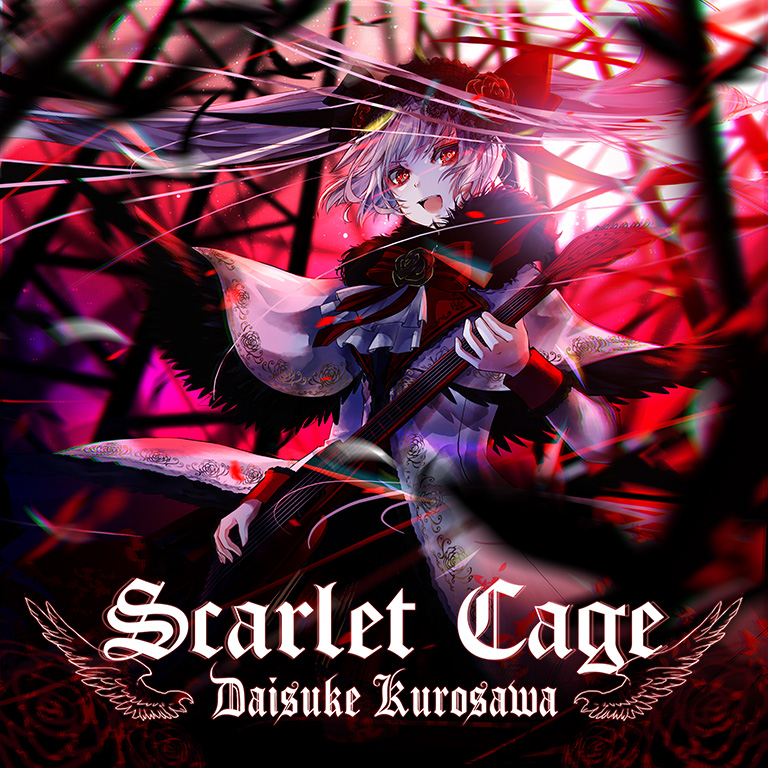

# Scarlet Cage

> *红笼*

- **Scarlet Cage 曲绘：**

- **曲师**：Daisuke Kurosawa
- **时长**：02:37
- **曲包**：Memory Archive
- **BPM**：166

### 谱面信息

| 难度 | Past | Present | Future |
| ------ | ------ | ------ | ------ |
| 等级 | 4 | 7 | 9+ |
| Note 数量 | 570 | 711 | 1195 |
| 谱面设计 | 赤Nitro | 赤Nitro | 赤Nitro |

- **背景**：yugamu
- **更新时间**：移动版v3.0.3(2020/07/08)

---

## 解禁方法

### 移动版
本曲各难度无需额外解禁

### Nintendo Switch版
• **Past**：游玩 Astral tale PST；游玩 carmine:scythe PST；25 残片
• **Present**：游玩 Astral tale PRS；游玩 carmine:scythe PRS；50 残片
• **Future**：游玩 Astral tale FTR；游玩 carmine:scythe FTR；75 残片

---

## 曲目定数

| 难度 | 定数 |
| ------ | ------ |
| Past | 4.0 |
| Present | 7.5 |
| Future | 9.8 |

• 本曲FTR难度谱面初出时的定数为9.7，在v4.0.0更新后改为9.8(+0.1)。

---

## 游戏相关

- 本曲是继~~Particle Arts~~之后，Arcaea中第二首在制作组名单里有独立Credit的曲子。
- 本曲PST难度谱面在v3.2.0修改过。
- 本曲有其对应的世界模式地图6-8，其奖励是调的觉醒材料，详情可查阅对应页面。

---

## 攻略

此章节可能包含主观内容。

**Future 9+**

- 换手天地交互较多，读谱难度较高，手感较为奇特，部分玩家可能会认为本谱难度在9+最上位。

---

## 试听

- · (YouTube) 【Arcaea】Scarlet Cage - Daisuke Kurosawa - Official Playthrough - Mayones Regius Core

---

## 相关视频
