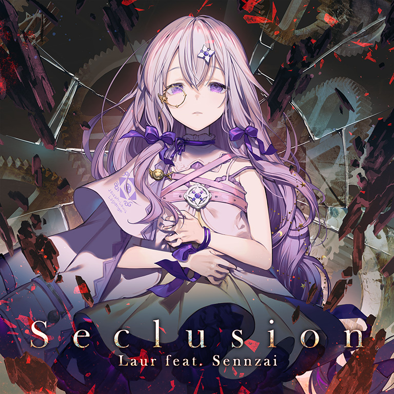

# Seclusion

> *What she's sitting on is nothing but tragedy...*

- **Seclusion 曲绘：**

- **曲师**：Laur feat. Sennzai
- **时长**：02:18
- **曲包**：Esoteric Order
- **BPM**：175

### 谱面信息

| 难度 | Past | Present | Future |
| ------ | ------ | ------ | ------ |
| 等级 | 4 | 7 | 10 |
| Note 数量 | 544 | 762 | 1132 |
| 谱面设计 | Exschwasion | Exschwasion | N•Ex•T |

- **背景**：observer_conflict
- **更新时间**：移动版v3.7.0(2021/07/21)

---

## 解禁方法

### 移动版
- 前置条件：在世界模式第六章，地图6-2，第一个奖励获得
• **Present**：200 残片
• **Future**：500 残片

### Nintendo Switch版
*前置条件：购买"Light of Salvation"DLC*

• **Past**：35 残片
• **Present**：65 残片
• **Future**：100 残片

---

## 曲目定数

| 难度 | 定数 |
| ------ | ------ |
| Past | 4.0 |
| Present | 7.0 |
| Future | 10.6 |

• 本曲FTR难度谱面初出时的定数为10.5，在v4.0.0更新后改为10.6(+0.1)。

---

## 游戏相关

- 本曲是Arcaea第2届公募比赛Arcaea Song Contest 2020的优胜曲目。
- 本曲是Arcaea中的第6首非实时更新曲包后期追加曲目。
- v4.0.0前本曲(FTR定数10.5)为全游定数最高的vocal曲，v4.0.0后被Testify(BYD定数12.0)超越。
- 由于Arcaea Song Contest 2020获奖曲师公布时间与制作阵容同样为Laur feat. Sennzai的另一首歌曲《Lure》发布时间相近，有部分玩家误认为获奖曲师名单中“Laur feat. Sennzai”对应的优胜曲目为《Lure》。
  - 事实上，对于独占曲和公募优胜曲，在游戏内实装该曲目之前发布属于违约行为。

---

## 歌词

### 原文

Branan Sia eus,
Ellas he diazar Walt.
Abschaulich Erinarung.
Bis xum End.[^1]

確かに示された望まない定めが
皮肉にも 煌めいた
希望は刹那で散った
狂い出す歯車
断ち切った貴方さえも
そう、これで
滿たされるならば
私で居られる...

全て壊して

全て閉ざして

光さえ 届かない瞳に何が映ろう
悪魔誘う 破滅だけ求めて
「もしも」が在ったのだろう
その手に縋れたのなら
突き刺した紅は滲む
戾れない 世界で

追憶も虚しいだけ
その淵に 何もないなら...
終焉の果てに眠ろう
この手の悲劇を
抱いて...

### 参考翻译

此章节所记录的歌词/翻译的来源不具有官方性质，仅供参考。
- 译者：青雀_Chugaev

请您燃烧至尽 世间一切
回忆栩栩如生 直至终焉

切实展现不期望的命运
并在讽刺地闪耀着辉光
刹那之间希望消散无形
就连被疯狂转动的齿轮
切断命运与希望的你也
是的，这样就已经
得到了满足的话
我便能继续苟活……

全部毁坏吧

悉数封闭吧

连光芒也无法照进的眼中 会映照出什么
被恶魔引诱 一心追求着毁灭
“如果”也曾存在过吧
若在那双手中编织而成
被刺穿后渗出猩红
便会再也无法挽回

回忆只不过是一片空虚
既然这片深渊空无一物……
就在终焉的尽头安眠吧
怀抱着这样的悲剧……[^2]

---

## 攻略

此章节可能包含主观内容。

**Future 10**

- 本谱以各种天地交互、中段的16分单单双和大跨度弓蛇、各种蛇侧卡手单点为主要配置，对玩家的技巧要求较高
  - 谱面的部分配置和手序引导较怪异导致初见难度较高，但由于配置整体强度和对各项能力不高，故在适当背谱后即可较好掌握该谱面
- 212-228combo的音弧在转折点后即失去物量，由于音弧结尾处有出张note，故可以利用该处判定提前松手原位点击note，以规避出张位移
  - 691-709combo的两处同理
- 248-340combo的build up段需要较好的背谱，可分为四个部分，第三部分地键出张较反直觉，需要额外注意；第四部分为右手地键—（右手天键+左手蓝蛇）—右手出张，特别注意一开始右手就需要出张
- 372-396combo的每次换手都间隔2个天键，蛇均贴近轨道边缘，需要额外注意定位
  - 后续出现了两段类似配置，但逐渐靠拢，只注意这两段开头的定位即可
- 396-427combo的天地交互中，前半为天地翻转交互，后半为类似AegleseekerFTR手序的翻转交互
- 450-521combo中出现了大量跨度较大的16分单单双和跨屏弓蛇，读谱和手序引导上不尽直观故建议慢速练习
  - 此处可不采取正攻手法，手序可根据自己游玩习惯和定位能力灵活调整，可尝试两处弓蛇都用同一只手接以改善手感
- 521-535combo的蛇可以两只手原地划
- 566-570combo的四个键为3连24分+12分，键型为地-天-地+天键，581-587combo的前三颗为类似的地-天-地键型，节奏为24分3连+12分单单双
  - 上述两处24混12也可馅为均匀的16分
- 605-624combo的12分推荐一手天一手地硬抗解决，可采用全换手法但不建议
- 733-778combo与248-340combo略有不同，第二段就开始有地键出张，同样需要注意反直觉的出张背谱
- 802-827combo的前半同样为翻转交互，后半段天键均由右手击打
- 827-940combo中，侧边的短蛇均只有1物量，蹭到即可，建议注意力集中于上部来回的弓蛇定位上
- 940-987combo建议开头就以左手拇指、食指接住Hold和红蛇以达成反接，964combo处的蓝蛇顺势以右手反接，可有效规避卡手
- 1029-1043combo为24分的4连+4连+7连（最后一个为天键）

---

## 试听

- · (QQ音乐) 试听

---

## 相关视频

- · (YouTube) 官方MV

---

## 注释

[^1]: 这一段并非现行的标准德语，目前网上对此有两种解释：一种认为其为中部高地德语；另一种则认为是德语的同音异写。但是其意义是基本确定的
[^2]: 本曲歌词疑似是对Arcaea主线剧情内容的总结，相关简要分析可见这篇专栏
