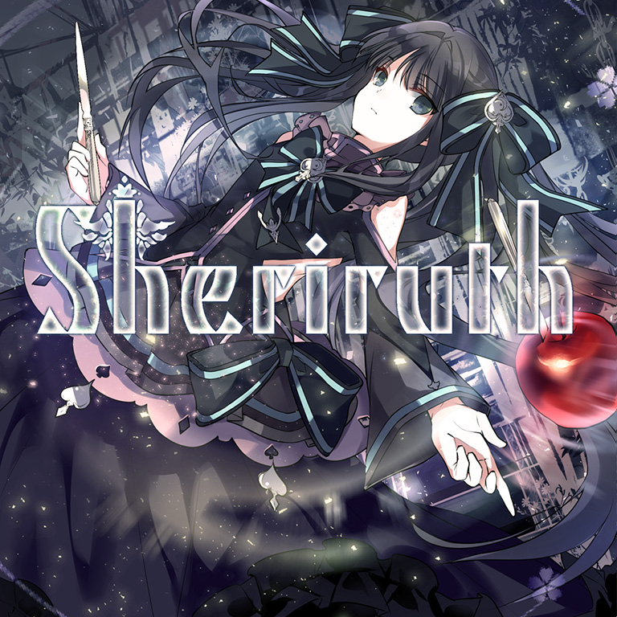

# Sheriruth

> *在这个混沌的世界，少女开始了她的旅程……*

- **Sheriruth 曲绘：**

- **曲师**：Team Grimoire
- **时长**：02:17
- **曲包**：Eternal Core
- **BPM**：185

### 谱面信息

| 难度 | Past | Present | Future |
| ------ | ------ | ------ | ------ |
| 等级 | 5 | 7 | 10 |
| Note 数量 | 611 | 832 | 1151 |
| 谱面设计 | 夜浪 | 夜浪 | 夜浪 |

- **背景**：sheriruth
- **更新时间**：移动版v1.0.5(2017/03/09)

---

## 解禁方法

### 移动版
• **Present**：通关 Essence of Twilight PRS；80 残片
• **Future**：以「A」或以上成绩通关 Essence of Twilight FTR；180 残片

### Nintendo Switch版
- 前置条件：在世界模式第一章，地图NS1-3，第二个奖励获得
• **Past**：游玩 Essence of Twilight PST；25 残片
• **Present**：游玩 Essence of Twilight PRS；50 残片
• **Future**：以「AA」或以上成绩通关 Essence of Twilight FTR；75 残片

---

## 曲目定数

| 难度 | 定数 |
| ------ | ------ |
| Past | 5.5 |
| Present | 7.5 |
| Future | 10.0 |

• 本曲FTR难度谱面初出时的定数为10.6，在v3.0.0更新后改为10.2(-0.4)，又在v4.0.0更新后改为10.1(-0.1)，又在v6.0.0更新后改为10.0(-0.1)。
• 本曲PRS难度谱面初出时的定数为7.8，在v3.0.0更新后改为7.5(-0.3)。

---

## 游戏相关

- 在v3.0.0大幅改标等级之前，本曲为PST 5，PRS 7，FTR 9+。
- 本曲以**Sheriruth(from.Arcaea)**的名义收录于Team Grimoire的个人专辑**Grimoire of Darkness**中。
- 本曲的重混版Sheriruth (Laur Remix)亦被收录于Arcaea。
- 本曲曲绘背景、Tutorial曲绘背景、游玩背景base（光芒 纷争）、场景“一切的始初”均来自同一张图——v1.5.0之前的游戏启动界面背景。
- 本曲FTR难度谱面在游戏早期有过微调[^1]。
- 在v4.3.0更新前，本曲目的获取具有前置条件：在世界模式第一章，地图1-5，第66格处获得。
- 本曲PRS难度谱面v5.4.0版本后定级修改为7+（但实际测量的定数仍为7.5，而7+难度的定数均为7.8），疑似为修改定数时出现了错误，已于v6.0.0更新后修复为正确定级 。
- 因联动收录至CHUNITHM。

---

## 攻略

此章节可能包含主观内容。

**Future 10**

- 本谱以大量中速长天地交互为主要配置，部分天地交互具有出张，整体对底力、稳定性和协调有一定要求，整体难度位于10级最下位
  - 由于本谱以交互配置为主，在游玩次数较多的情况下容易凭借肌肉记忆游玩，忽视读谱后较难注意定位导致lost，甚至可能形成手癖，因而不建议玩家在熟悉整体配置难点并充分练习前过多游玩该谱面
  - 部分交互配置（如天地扫、尾杀的出张交互等）可以参考键型相似但BPM较低的TRPNOFTR(BPM:150)进行练习
- 开头的八分地键单双建议在需要位移的时候再位移
- 570-600combo出现的双押夹16分交互三连注意发力紧张
- 639-647combo的天地扫交互为右手天键起手
- 753combo开始的长天地交互为天键右起手，略易手癖，部分天1地3键型需注意天键手来回（可参考A Wandering Melody of LoveFTR）
  - 其中681、720、800、827combo处为24分交互，可根据排键注意发力紧张
- 831、844combo开始的天地7连交互分别为天键左、右起手，容易被骗手
- 885combo开始的大蛇有数次需要划到地面轨道最边缘，注意定位
- 970combo后的交互具有较大出张，部分交互为三角交互但跨度较大，为本谱最主要的手癖点，建议充分熟悉定位位移
  - 977、990combo开始的天地交互分别为天键左、右起手，1075-1091combo的形态交互与之类似
  - 1059-1077combo处地键涉及较大出张，注意定位，可参考HeartFTR、Swan SongFTR练习

---

## 试听

- · (YouTube) Sheriruth

---

## 相关视频

- https://www.bilibili.com/video/BV1LK4y1T74F
- https://www.bilibili.com/video/av16657948
- https://www.bilibili.com/video/av19405051

---

## 注释

[^1]: 调整了两条音弧的颜色({{Bilibili|BV1iW411K7ej|旧谱面视频}})。
