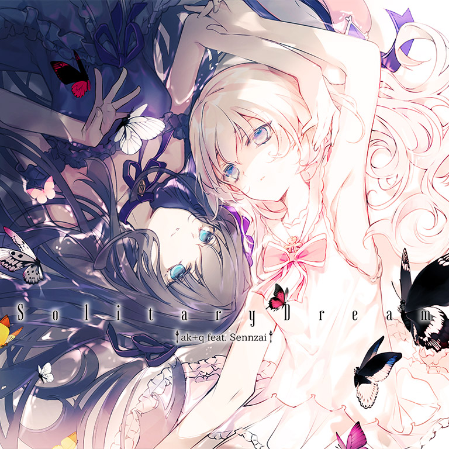

# Solitary Dream / 虚空の夢

- **Solitary Dream 曲绘：**

- **曲师**：ak+q feat. Sennzai
- **时长**：02:53
- **曲包**：Eternal Core
- **BPM**：162

### 谱面信息

| 难度 | Past | Present | Future |
| ------ | ------ | ------ | ------ |
| 等级 | 4 | 7 | 8+ |
| Note 数量 | 712 | 854 | 972 |
| 谱面设计 |  |  |  |

- **背景**：solitarydream
- **更新时间**：移动版v1.9.3(2019/03/09)

---

## 解禁方法

- 前置条件：在世界模式第五章，地图5-1，第一个奖励获得

### 移动版
• **Present**：200 残片
• **Future**：500 残片

### Nintendo Switch版
• **Past**：游玩 PRAGMATISM PST；游玩 Sheriruth PST；35 残片
• **Present**：游玩 PRAGMATISM PRS；游玩 Sheriruth PRS；65 残片
• **Future**：游玩 PRAGMATISM FTR；游玩 Sheriruth FTR；100 残片

---

## 曲目定数

| 难度 | 定数 |
| ------ | ------ |
| Past | 4.0 |
| Present | 7.0 |
| Future | 8.8 |

• 本曲PRS难度谱面初出时的定数为7.2，在v3.0.0更新后改为7.0。
• 本曲FTR难度谱面初出时的定数为8.4，在v3.0.0更新后改为8.8。

---

## 游戏相关

- 在v5.4.0大幅改标7级及8级的等级之前，本曲FTR难度的定级为8级。
- 本曲是Arcaea官方发布的二周年纪念曲，也是Arcaea中第1首非实时更新曲包后期追加曲目。
  - 值得一提的是，本曲vocal担当Sennzai的出道日期(2011.3.9)与Arcaea发布日期(2017.3.9)为同月同日。
  - 在2025年2月15日，Sennzai的首场个人演唱会"Moment of Bloom"中，本曲为夜场的开场曲。
- 本曲在更新后成为了启动界面的播放曲目[^1]，后于v4.0.0时被更换。
- 本谱面在游戏中未显示谱师名义，推测是为了与曲名“虚空の夢”相照应。
- 本曲在游戏内拥有两种语言的对应封面，游戏语言设置为日文时显示将日文封面，为其他语言时将显示英文封面。
- 本曲谱面曾因Google商店更新预传出错而遭泄露至YouTube，涉事视频标题为自制谱，但实际内容与官方正式谱完全一致。
  - [采访表明，本谱为Toaster所作]。
- 本曲FTR难度谱面曾为全游解锁需要残片最多的谱面 (500残片)，在v2.5.0版本被SAIKYO STRONGER FTR超越 (1000残片)。
- 本曲曾为全游时长最长曲 (2:54)，v3.8.6更新后被lastendconductor和goldenslaughterer (3:04)超越。

---

## 歌词

### 原文

- 以图片形式在Twitter的官方日文账号上发布[^2]

静寂が刺す 凍てついた水面に
歪な記憶が 木霊した
手に纏う蝶 何を映し出すの
世界の価値を 教えて

光に囚われ 逃げてた
綻び 閉ざされた城で 忘れていたの
独りに慣れて 声出すこともなく
楽園に侵されたままで

静寂が問う

何故生まれ落ちたの 映す情景の奥へと
静寂に問う 早まる鼓動で

ah 崩れ散ったの 無垢な過ちが
引き返す道を許さないわ
歩み続けて 辿り着く先へと
其処に答えがあるはず…

静寂に問う 答えを求めて

### 英文翻译

- 此为Twitter上的官方英文账号所发布的英文翻译[^3]。

In stinging silence, twisted memories echo
on the frozen water's surface
What do the butterfiles encircling my hands reflect?
Teach me the worth of the world

I'd been running away, entrapped by the light
I'd forgotten, in a castle sealed away and coming apart
I'd been used to the loneliness,
broken by the paradise without saying a word

The silence asks me

Into the depths of the reflected scenery, my pulse quickening,
I ask the silence: why was I born?

Ah, the images shatter, and my innocent mistakes
will not allow me to retrace my steps
And so I keep on walking toward my destination,
where the answers should lie...

I ask the silence, and seek the answers

### 参考翻译

此章节所记录的歌词/翻译的来源不具有官方性质，仅供参考。
- 译者：现世的魔法少女

锐利寂静间 止如冰结的水面上
歪曲的记忆 久久回响不绝
指尖的翼蝶 你所映照的为何物
请你教给我 世界的价值吧

我受光芒囚禁 持续着逃避
绽裂于封闭之城 淡忘所有
接纳了孤身一人 陷入沉默
任由乐园之景缓缓侵蚀

寂静向我叩问

我因何而诞生 深入折射光景的底处
我求问寂静 心跳不断加快

ah 一切崩碎 我天真的过错
早已断送了身后的归路
只得继续前行 直到注定交织的那一刻
或许便能得知欲求的答案…

我求问寂静 仍追寻着答案

---

## 攻略

此章节可能包含主观内容。

**Future 8+**

- 本谱以较初级的出张、中长交互和后半段的各类三连小交互为主要配置，整体配置较为综合友好，适合作为8+难度的初步上手练习
- 尾段的红蓝双蛇尾端有碎蛇，建议在Hold即将到来时再松开蛇，注意手不要提前抬起

---

## 试听

- · (QQ音乐) ak+q / Sennzai - 虚空の夢
- · (QQ音乐) ak+q - 虚空の夢 (OP ver.)
- · (YouTube) 虚空の夢

---

## 相关视频

---

## 注释

[^1]: 该版本与原曲有出入，删除了所有歌词，详见试听章节中的{{Lang|ja|虚空の夢}} (OP ver.)试听。
[^2]: 原推文
[^3]: 原推文
