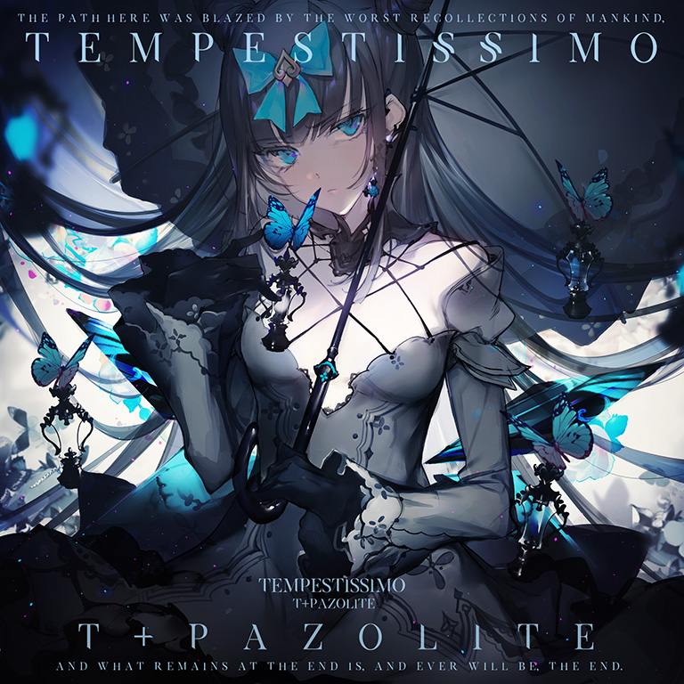
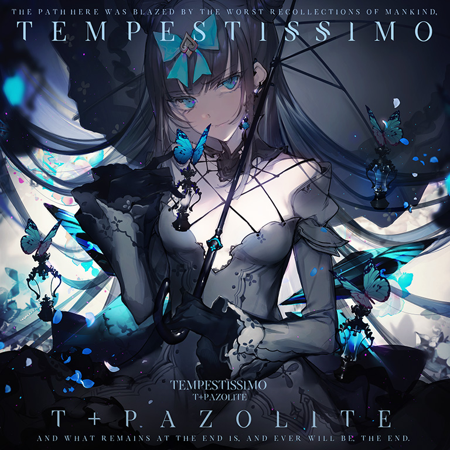
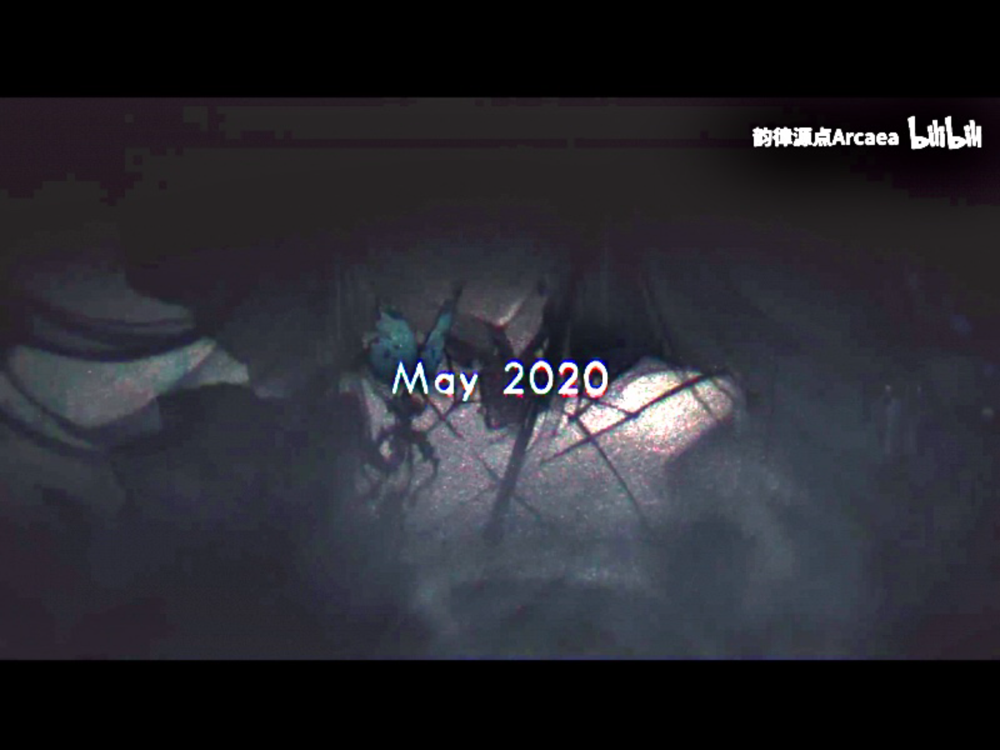

# Tempestissimo

> *风暴*

- **Tempestissimo 曲绘：**

- **Beyond 曲绘：**

- **曲师**：t+pazolite
- **时长**：02:17
- **曲包**：Black Fate
- **BPM**：231

### 谱面信息

| 难度 | Past | Present | Future | Beyond |
| ------ | ------ | ------ | ------ | ------ |
| 等级 | 7 | 9 | 10+ | 11+ |
| Note 数量 | 919 | 1034 | 1254 | 1540 |
| 谱面设计 | Prelude - Ouverture | Convergence - Intermezzo | Onslaught - Crescendo | Finale - The Tempest |

- **背景**：tempestissimo

---

## 解禁方法

### Past/Present/Future难度解锁挑战
1. 根据提示解锁并阅读故事VS-6；

2. 点击锁定的隐藏曲，出现一个特殊画面。中间是锁定的隐藏曲封面，两侧的四项锁定内容需要完成以下挑战以解锁:
- 左一:使用包含“困难”的技能的搭档通关曲目Equilibrium **或** 以EX(及以上)评级通关5次曲目Equilibrium
  - 如果使用清除本地的Arcaea存档来重新解锁该曲，也可以使用对立（Tempest）通关
  - 离线状态下，无法通过采用技能包含“困难”的搭档通关曲目完成挑战
- 左二:通关曲目Antagonism时最高连击数不低于300 **或** 以AA(及以上)评级通关5次曲目Antagonism
  - 连击数正好为300时判定为未完成挑战(即实为超过300)
- 右二:依照顺序**连续**通关:Equilibrium，Antagonism，Dantalion
  - 不可重开，中间不能失败，不限制通关类型
- 右一:通关曲目＃1f1e33
  - 不限制通关类型

**注意:**
- 点击旁边的黑幕可以离开此界面，你可以随时回到这个画面；
- 所有挑战都可以并行，即按序连续完成左一、左二的挑战后，右二可以直接通关Dantalion完成挑战；
- 曲目挑战难度向下兼容，即FTR挑战完成后就可以解锁三个难度的挑战锁，而完成PRS挑战只能解锁PST、PRS两个难度的挑战锁，FTR难度则需重新完成；

3. 某一难度的所有挑战全部完成后，中间带锁的曲目封面将会随不安的音效逐渐放大，随后瞬间短时间黑屏。
随后屏幕最右边出现"continue."字样，点击中间被遮盖一半的曲目封面进入故事VS-7 [^1] (剧情相应地也会解锁)。
剧情结束会进行一次游玩，游玩时回忆收集条会被隐藏，无论是否完成均可解锁对应难度及更低难度的谱面。
- 点击其他地方会退出此界面，此时可重新点击隐藏曲位置再次回到此界面；
- 游玩过程中暂停按钮被隐藏，可以通过切屏进行暂停，但是暂停界面没有重试选项；
  - 强制关闭游戏或者选择退出谱面可以直接解锁对应难度，但如果没有任何本曲的游玩记录(不区分难度)，进入后仍需要进行一次隐藏回忆收集条的游玩。
- 剧情只会在第一次解锁游玩时出现。
- 若满足异象触发条件，即便此时回忆条隐藏，也会进入异象，解锁进度和规则不变；
- 如果从世界模式第一次游玩本曲的某个难度，将会强制改为普通模式，最终结算时成绩正常上传，并提供残片奖励，但不会消耗体力，搭档也不会获得经验值。

### 异象与Beyond难度
1. 采用**未封印**的光（Fracture）游玩本曲，游戏在 84.155s-84.355s 时会判定回忆率是否满足异象的触发条件:
- **离线**或角色等级为1~5级时，需要全连在此之前所有音符(即无lost判定)；
- 角色等级为6~10级时，回忆率应高于固定数值，计算公式为 `130 - 6 &times; 等级`；
- 角色等级为11~20级时，回忆率应高于固定数值，计算公式为 `120 - 5 &times; 等级`。
不同等级的光（Fracture）对应的本曲解锁条件如下表:

| 等级 | 1-5 | 6 | 7 | 8 | 9 | 10 | 11 | 12 |
| ------ | ------ | ------ | ------ | ------ | ------ | ------ | ------ | ------ |
| 回忆率要求 | 全连 | 94 | 88 | 82 | 76 | 70 | 65 | 60 |
| 等级 | 13 | 14 | 15 | 16 | 17 | 18 | 19 | 20 |
| 回忆率要求 | 55 | 50 | 45 | 40 | 35 | 30 | 25 | 20 |

- 注：在世界模式中不会触发本异象。

2. 异象触发时，会发生如下变化：
- 谱面难度向上递增(PST→PRS→FTR→BYD)；
- Sky Input变红，背景变为tempestissimo_red，地面判定基准线和轨道分界线消失；
- 隐藏FR/PM指示灯、暂停按钮、分数和Track Progress信息，随后显示提升后的难度、等级和代表该难度的底色；
- 回忆收集条改为“风暴收集条”模式，同时隐藏收集条的具体数值；
  - 具体效果为:以Hard收集条确定单个Note的回忆率变化总量后，按风暴收集条的增减模式对回忆条产生影响，即回忆率增减不是立即增减而是逐渐靠近最终值。
  - 触发异象后的起始回忆率与光（Fracture）的等级有关，离线时进入异象后以60回忆率开始，而满级的光（Fracture）将会以100回忆率开始。
<!--
  - 触发异象后的起始回忆率与光（Fracture）的等级和当前回忆率有关，计算公式为 `最大值(当前回忆率, ((等级 - 1) &div; 19) &times; 50 + 50)`
不同等级的光（Fracture）对应的最低起始回忆率如下表:

| 等级 | 1 | 2 | 3 | 4 | 5 | 6 | 7 | 8 | 9 | 10 |
| ------ | ------ | ------ | ------ | ------ | ------ | ------ | ------ | ------ | ------ | ------ |
| 最低起始回忆率 | 50 | 52 | 55 | 57 | 60 | 63 | 65 | 68 | 71 | 73 |
| 等级 | 11 | 12 | 13 | 14 | 15 | 16 | 17 | 18 | 19 | 20 |
| 最低起始回忆率 | 76 | 78 | 81 | 84 | 86 | 89 | 92 | 94 | 97 | 100 |

-->
- 出现对立（Tempest）的动态立绘，并且表情随着游玩过程不断变化；
  - 如果回忆率恢复速度持续降低对立会报以愉悦的微笑，如果回忆率恢复速度持续升高会不悦，如果在某一段一直全连[^2]或成功通过异象则会在一段时间后以惊讶兼生气的表情回应[^3]。

3. 若**成功通关**，则:
- 在结算页面显示“World Map Unlock”并解锁世界地图5-4和5-7；
- 若在FTR难度谱面触发异象后通关，会在结算页面显示“Anomaly Song Unlocked”并且直接解锁BYD难度谱面。
- 如果同时满足以上两条，则会先显示“Anomaly Song Unlocked”再显示“World Map Unlocked”。
若未能成功通关：
- 如果在FTR难度谱面触发异象后Track Lost则会在结算页面显示“Anomaly Lost...”并获得解锁进度，当解锁进度累积至100%时，即可解锁BYD难度谱面。
- 若游玩的是PST或PRS难度谱面，则结算时既不累积进度也不解锁提升难度后的谱面。

达成以下条件后，会使对应的异象暂时无法再次触发:
- 解锁世界地图5-4和5-7：使PST和PRS难度谱面的异象暂时无法触发；
- 同时解锁世界地图5-4、5-7和本曲的BYD难度谱面：使FTR难度谱面暂时无法触发异象；
- 无论如何，BYD难度谱面永不触发异象。

异象触发后不管是否成功解锁，都不会获得残片。与此同时获得的分数上会以“NOT SAVED”字样划去，且不会在本地和服务器保存或触发潜力值变化检测。

- 分数会按照Pure、Far、Lost三种判定的数量重新计算，所以除非达成Pure Memory，否则不会获得超过10000000的分数。
- 如果在异象开始的一瞬间(暂停键刚好隐藏时)，此时切出游戏再切回来时游戏会暂停，仍然可以在原来的收集条下继续游玩异象。
:但是游玩结束时即使达成Track Complete也不会被认为通过异象，会被认为是一次“正常”游玩。
:*具体表现为正常获得残片，右下角显示重试按钮，但分数仍被划去不被保存。
- 当玩家购买了Final Verdict曲包，完成了Axiom of the End的全部挑战并解锁Testify后，只要满足进入异象的全部条件就可以进入异象，无论异象所属的谱面难度是否被解锁。
  - BYD难度仍然无法触发异象。

过去版本的情况

**前三难度解锁挑战**
- v3.12.0前，右一为解谜挑战，点击会出现输入框，要求访问网址 https://lowest.world/connect ，获得动态密码并输入。
  - 解谜挑战一经解锁，该挑战三个难度的挑战锁均解锁；
  - v3.12.0后解锁方式改变，但此前输入过密码的玩家不需要重新完成右一挑战，曲绘会自动显示并在其下方显示“通关＃1f1e33”。

**右一的解谜过程**
1. v2.6.2更新后故事V-5结尾的To Be Continued下方多了一行字符串:`2-F!t<A\bPDbN_`。
- v3.0.0更新后To Be Continued被去除，但该字符串仍然存在。v3.3.0更新后，此字符串被删除。
这个字符串是使用Ascii85编码后的内容，解码得到一个新字符串:`5YWmU4s2oLI`。

2. 这个新字符串是YouTube的视频ID，输入后可以看到一个· (YouTube) 非公开视频

---

## 曲目定数

| 难度 | 定数 |
| ------ | ------ |
| Past | 7.0 |
| Present | 9.5 |
| Future | 10.7 |
| Beyond | 11.7 |

• 本曲BYD难度谱面初出时的定数为11.5，在v6.0.0更新后改为11.7(+0.2)。
• 本曲FTR难度谱面初出时的定数为10.6，在v4.0.0更新后改为10.7(+0.1)。
• 本曲PST难度谱面初出时的定数为6.5，在v5.4.0更新后改为7.0(+0.5)。

---

## 游戏相关

> *预览视频2:12处截图*
- 曲名Tempestissimo是Tempest(暴风雨)和意大利语后缀-issimo(非常)的组合词。
  - 也可以理解为Tempest和prestissimo(曲速非常快；最急板)的组合词：本曲BPM为231，在Arcaea中属于较快的一批。
- 本曲并没有直接出现在Black Fate曲包的预览视频中，而是引用了一小段音源，而且隐约能看到曲绘，参见右图。
- 本曲是Black Fate曲包两首隐藏曲目中的其中一首曲目，同时也是第一首可解锁Beyond难度的曲目。
  - 此外本曲的Beyond难度也是NS v2.0.1前NS版唯一能解锁的Beyond难度。
- 本曲是t+pazolite独立供给Arcaea的第一首原创曲目(先前收录的OMAKENO Stroke、Garakuta Doll Play和Oshama Scramble!是以与其他游戏联动的形式收录，而IZANA是与P*Light合作提供的原创曲)。
- 本曲的加长版收录于特典专辑Memories of Wrath中。
- 本曲的BYD难度谱面在2020/5/29被TAKUAN达成首个理论值，仅存活56小时(包括解谜的时间)。
- 本曲的BYD难度谱面在衔接异象的四押段出现了全游首个纵向超界音弧(y=1.01)。
- 本曲的BYD难度谱面结尾处出现了全游首个全地键(hold)四押。
- 初出时本曲的BYD难度谱面以高达11.5的定数成功取代了Grievous Lady FTR(v3.0.0时为11.3)成为全游难度新高，直至v4.0.0更新后被Testify BYD(12.0)取代。
- 曲绘上写有英文：**The path here was blazed by the worst recollections of mankind.
And what remains at the end is. And ever will be the end.**此处的道路尽收人类所能拥有的最恶回忆。而存在于终点的——
始终都——只会是终点。
  - 这句摘自VS-6结尾，是解锁本曲前可以阅读的最后一段主线故事的最后一句话。
- 本曲Beyond难度的曲绘与其他三个难度的不同之处在于对立的表情与其身旁环绕的碎片。
- 在解锁本曲的挑战过程中，各项挑战通过时均会显示一行文字，从左至右依次为：
  - The girl in white and the girl in black cannot reconcile.
  - She once more faces the girl she wishes she could befriend.
  - And thus it is Tairitsu's turn to gain the upper hand.
  - She spares no hesitation. The strike comes in an instant.
  - 各句分别摘自VS-1、VS-2、VS-5、VS-4。
- 本曲的FTR难度谱面在v4.0.0被修改过，主要为移动了两处sky note的位置。
- 因联动收录至O.N.G.E.K.I.和CHUNITHM。
  - 本曲是至今为止Arcaea联动时供出的定数最高的曲目。
  - 上一次将最难曲作为联动曲供出是与CHUNITHM第一次联动时供出了Grievous Lady和Fracture Ray。
- v6.0.0更新后，本曲BYD难度谱面虽然拥有11.7的谱面定数，但是标定的难度等级仍为11，这造成了时隔许久后的又一个官方诈称。

---

## 攻略

此章节可能包含主观内容。

**Beyond 11**

- 长时间和高频的爆发与高达231的高BPM标志着本谱对于底力的极高要求，底力不足的话不建议冒险试着以通关的方式解锁此难度
  - 可以在FTR难度中多加练习爆发后再试着解锁此难度，不过若没有足够的实力仍建议依靠解锁进度来解锁，解锁之后再用普通或者简单血条练习完整谱面
- 开头的8分纵连硬抗段混合了少许16分，注意节奏
- 中段出现了比SAIKYO STRONGER更吃体力的相似配置
- 打电话段(736)长条交互注意不要打早，因为判定的原因打早容易吃音导致Lost
- 1084为12分三纵，可抗可拆
- 1252开始是32连16分交互，比看起来难很多，建议慢放练习
- 尾杀前半部分为位移高速双押，需要定位，后半部分是24分混合16分的交互，在231bpm下很难双指硬抗，建议使用4k手法解决

**Future 10+**

- 为了在异象中衔接Beyond难度，本谱面在738combo的位置出现了两条出界黑线
- 中段出现了与corps-sans-organes后段相似的配置
- 开头的两条蛇可以通过反接降低难度

**Present 9**

- 本谱面有着比PST难度谱面更多的8分叠键和较多的16分交互，对底力要求很高，且在231BPM的加持下部分如单单双等配置也有相当的难度，有极大的个人差，会打的觉得是9级上位，不会打的觉得是9+
- 485-553combo出现了大量8分单单双，在注意地键手序分配外还需注意发力紧张
  - 在Awaken In Ruins前半段中出现了类似的16分单单双配置（等价于250BPM下的八分单单双），可与本谱面作为互相练习的参考
- 有两段大位移连续双押，如果位移跟不上可以使用多指
- 有两段分别有4组3连16分天键交互的配置吃读谱和协调，若不追求准度可以当做均匀的12分交互(等效为173.25bpm下的16分交互)

**Past 7**

- 含有大量8分楼梯和叠键，对底力要求较高，PM难度达到了7级上位

---

## 试听

- · (YouTube) 官方音源
- · (QQ音乐) 试听

---

## 相关视频

- https://www.bilibili.com/video/BV1or4y1q7q9
- https://www.bilibili.com/video/BV1DU4y1t7RP
- https://www.bilibili.com/video/BV1KT4y1m767

---

## 注释

[^1]: 可观看该段剧情的录屏 (百度网盘 ，提取码c616)。
[^2]: 这种情况在FTR→BYD难度最早会在1009combo处出现，并且不会一直显示惊讶表情，参见: {{Bilibili|BV1WV4y1s789|【Arcaea谱面保管室/谱面演出】Tempestissimo &lsqb;FTR→BYD&rsqb; 谱面确认|t=93}}
[^3]: 实际上，控制表情的图片仅有35_twisted.png与35_angry.png，普通表情为底板图片，上部分描述表情的语句内的“不悦”以及“惊讶兼生气”统一使用35_angry.png，“愉悦的微笑”则为35_twisted.png。
