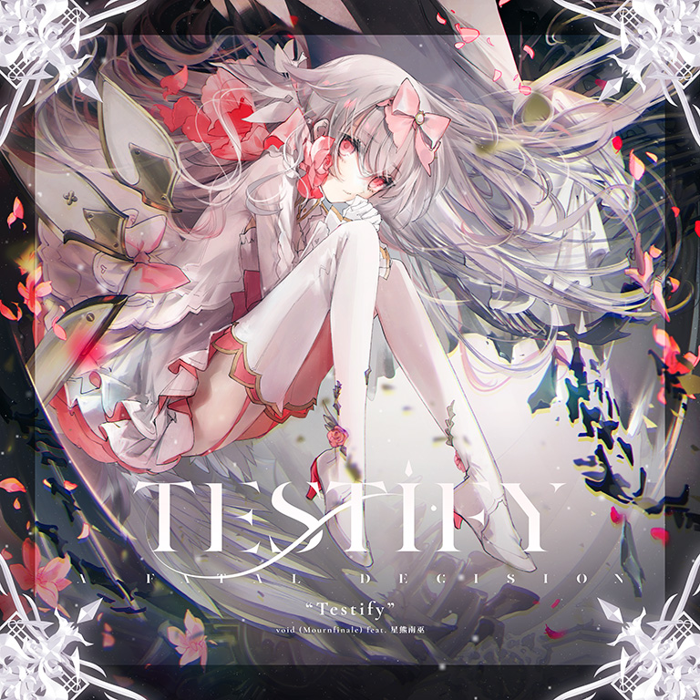

# Testify

> *宿命岂是凡人能够见证？*

- **Testify 曲绘：**

- **曲师**：void (Mournfinale) feat. 星熊南巫
- **时长**：02:56
- **曲包**：Final Verdict
- **BPM**：178

### 谱面信息

| 难度 | Past | Present | Future | Beyond |
| ------ | ------ | ------ | ------ | ------ |
| 等级 | 7 | 9 | 10+ | 12 |
| Note 数量 | 1001 | 1225 | 1766 | 2221 |
| 谱面设计 | Eternal¦PAST | Adverse¦PRESENT | Black¦FUTURE | Silent¦END |

- **背景**：testify
- **更新时间**：移动版v4.0.0(2022/07/07)

---

## 解禁方法

**请注意：**
1. 在完成本曲解锁以后，你的所有“对立”搭档[^1]将暂时被**隐藏**且无法使用。
  - 解锁本曲需要联网向服务器端进行确认，并且同时会激活一个特殊参数，因此一旦做出选择就无法回头。
  - 在Arcaea Online上仍会显示“对立”搭档，但选择搭档的按钮会被禁用，无法被点击。
  - 在联网游玩一次Last，选择选项“拒绝命运的安排”后，被隐藏的对立搭档将得到恢复。
  - v6.0.0版更新的全新开场[^2] 在此情况下也不会出现对立，但是游戏开场白中的“对立”二字(以及英文conflict)会正常显示，不会因为这个剧情发生改变。
1. 在完成解锁后，不需要立即更新云端存档，若回档导致对立被隐藏，也可以只使用光相关的搭档来缩减Testify的红条，即需要使用对立的所有解锁条件都会被立即完成，无需担心在没有对立的情况下不能完成Axiom of the End。
1. 如果你想再次体验这个过程，可以在这之后通过切换新账号或是回档的方式将Axiom of the End回退到做出决定之前的状态，重新体验插入的剧情、选择解锁难度和体验异象，且对立将不再被隐藏而可以正常被使用。
  - 再次解锁时已经完成的解锁条件无需再次完成，血条也会自动归零，
  - 如果在再次解锁游玩**Testify**时通过切换应用程序退出歌曲，对立会被隐藏，若此时选择搭档为“对立”搭档开始歌曲会导致程序闪退。重启游戏或回到首页后对立隐藏恢复

1.完成Infinite Strife,、World Ender、Pentiment、Arcana Eden的解锁。

2.进入Axiom of the End中心位置，共4项任务需解锁：
- I - 回忆旅途的过往：按顺序从1.x到4.x各通关一首曲目
  - 按顺序分别游玩v1.x(v1.0 ~ v1.5)、v2.x(v2.0 ~ v2.6)、v3.x(v3.0 ~ v3.12)、v4.x(v4.0 ~ v4.7)的各一首并达成Track Complete。[^3]
  - 不区分通关类型。[^4][^5]
  - 游玩过程中可以暂停游戏或更换搭档，但不能重试曲目。
- II - 牵着她的手：使用“喜爱”功能收藏所拥有的全部非联动的对立搭档，使用搭档对立或其分支游玩曲绘中含有该搭档的主线曲包中的曲目并联网上传成绩。
  - 需要收藏的搭档：对立、对立（Axium）、对立（Grievous Lady）、对立（Tempest）、对立（夏日）、对立（Sonata）、对立（Elegy）。其中没有获取的搭档不需要去专门获取，只收藏已有的即可。
  - 选择游玩的曲目：Infinite Strife,、Iconoclast、Antagonism、Tempestissimo、BLRINK、Essence of Twilight、Grievous Lady、Sheriruth、Axium Crisis、Dantalion。只需要游玩其中一个即可，无需全部游玩一遍。
- III - 注视一切的终结：在解锁页面停留四分钟。
  - 停留的页面是Axiom of the End的主页面，不是本曲的解锁页面。
  - 期间可以临时切出游戏、息屏与开启小窗，但在切出时与息屏期间计时会暂停。
- IV - 超越你的极限：游玩任意曲目且结算时该曲潜力值大于个人潜力值。
  - 关于潜力值的信息，点击此处
缩略图

---

## 曲目定数

| 难度 | 定数 |
| ------ | ------ |
| Past | 7.8 |
| Present | 9.4 |
| Future | 10.9 |
| Beyond | 12.0 |

• 本曲PST难度谱面初出时的定数为7.0，在v5.4.0更新后改为7.8。
• 本曲FTR难度谱面初出时的定数为10.8，在v6.0.0更新后改为10.9。

---

## 游戏相关

- 本曲属于一个既不同于光芒侧也不同于纷争侧的崭新分侧——“消色之侧”（Achromic Side，又称Colorless Side），同时也是这个分侧中的第一首曲目。
  - 其地面轨道判定线和轨道本身与光芒侧相比，整体更偏向于泛淡紫的白色。
  - 在选曲界面中，左下角标记分侧的曲目卡片色亦为泛淡紫的白色，而非光芒侧曲目的天空蓝色。选中消色之侧曲目的界面背景和曲绘下方的阴影颜色也均有所不同。
  - 由于本曲不属于光芒与纷争的任意一侧，因此搭档光 & 对立（Reunion）的技能无法触发。
- 本曲解锁后会激活所有初始游玩效果的触发机制，满足对应条件即可重新触发对应初始游玩效果。
  - 若通过回档等方式导致本曲目被回锁，则重复触发各初始游玩效果的触发机制亦会被重新回锁。
- 本曲的各难度谱面出现了与Pentiment和Arcana Eden相同的事件：曲目进行到某一时刻时，镜头会拉远，并在面板最左侧和最右侧生成两条透明的轨道。
- 本曲谱面于诸多方面的难度上均**远远超出**先前所有曲目，刷新了多项纪录。以下是对这些纪录的一些归纳：

1. 本曲的BYD难度谱面是Arcaea的第一个12级谱面，其高达12.0的定数成功取代了Tempestissimo BYD成为全游难度新高。
1. 本曲凭借着BYD难度高达12.0的定数，取代Seclusion(Future 10.6)成为全游定数最高的vocal曲并延续至今。
1. 本曲的PST难度谱面是Past难度下的第一个7级谱面；5.4版本定数大调整后其晋升为唯一的Past 7+级谱面。
1. 本曲的BYD难度谱面高达2221的物量成功取代了＃1f1e33 FTR(1576)成为全游物量最高的谱面。[^6]
1. 本曲的BYD难度谱面的结尾处出现了Arcaea常驻谱面中第一个真正意义上的“五押”。[^7]
1. 本曲FTR难度谱面的结尾出现了Arcaea谱面中的第三个全地键四押，并且也是该配置唯一一次在FTR难度谱面中出现。
1. 本曲FTR难度谱面的物量(1766)在推出时为10+级谱面中最高，v5.3.0更新后被Einherjar Joker BYD(1857)超越。
1. 本曲BYD难度谱面的note密度(12.62note/s)在推出时为全游最高，v5.3.0更新后被Einherjar Joker BYD(13.46note/s)超越。
1. 本曲的所有难度皆是Final Verdict曲包内对应难度下所有歌曲中定级最高的。

- 使用封印技能的光（Fatalis）可以重复触发本曲解锁时的异象，异象结束后将正常结算成绩。
  - 在离线状态和在世界模式游玩中也可以触发。
    - 但是在世界模式游玩时将**不会**结算世界模式进度，而体力会正常消耗。游玩结束后将返回常规的选曲界面。
  - v6.0.0更新后，本曲的预览PV也会被一并触发，并且可以在曲绘出现时选择即将游玩的难度。
    - 该游玩效果在世界模式中不会触发。
- v4.0.0初次发布时，本曲的BYD难度谱面的1444combo处存在note重叠的问题。
  - lowiro在7月8日更新了新的谱面，移除了重叠的note，并在270combo处新增了一条隐形的1物量Arc使谱面整体总物量不变。
- v4.0.0更新并解锁本曲后，iOS端的应用图标将会从Lost Desire曲封的一部分[^8]替换成本曲曲封的一部分[^9]，而安卓端[^10]不会有任何变化。
- 本曲BYD难度谱面在2022/7/10下午15时37分被玩家SkisK49达成全球首次PM，分数为10002188(Max-33)，用时66小时37分钟；在2022/7/28下午13时18分被玩家TnG24005saikou达成**全球首次理论值**，用时20天16小时18分钟。
- 本曲在官方公布于账号动态时，图片中右上角有标注文字：“Fatal Choice”。
- 本曲的BYD难度谱面中，大部分音都采的是节奏钢琴，导致采的vocal甚至不如采的人声采样多。
- 本曲的PRS、FTR、BYD难度谱面开头的慢速段均出现了相同的采音错误，将24分误采成了32分。
- 曲绘上注有英文：**A FATAL DECISION**。

---

## 歌词

### 原文

Darkest night, I'll confront you here....

Such a destiny was not desired.
In this place, I never wished to see that side of you.
And raise different colors for one another.
Never notice me.
Never call my name with your voice.

Let me forget everything and leave no trace of you.
What am I carrying out in this horizon of despair?
If it's not you, I can hurt anyone in the name of justice.
Your shadow gets in the way of my light.
And testify....

Let me forget everything, still moonlight shines on us.
Broken heart, I don't want you to find and take a look at.
So I'll sin more and destroy my thoughts, make a mess of my hand.
I swear on the darkest night I'll end it all.
And testify....

All that I'm left with is your reminiscences.
Take me to where you are, won't you?
Till then I'll keep struggling.
Curse of justice you don't know.

### 参考翻译

最黑之夜，我将在此与你对峙……

这般的宿命是不被冀望的
我从不希望在这看到你的另一面
并为彼此唤起对立于彼此的颜色
不要注意到我
永远不要用你的声音呼唤我的名字

让我忘却一切，不留下你的痕迹
在这绝望的地平线上，我在做什么？
若不是你，我可以以正义的名义伤害任何人
你的影子占据了我的光轨
并予以作证……

让我忘却一切，却仍有月光照耀著我们
不想让你发现和入眼，我这破碎不堪的心
所以我更要执行罪行，将我的思绪摧毁殆尽，予以手边混乱
我发誓在最黑之夜终将结束这一切
并予以作证……

留给我的只有你的回忆
带我到你所在之地，好吗？
到那时我将继续挣扎
你所不知晓的名为正义的诅咒

---

## 攻略

此章节可能包含主观内容。

**Present 9**

- 49是一处32分二连
- 158起的8组蛇-地键-双押-地键，第4和8组可以反接蛇减少出张
- 384和402天键建议音押，目押很容易far
- 413为6连6分接16分交互
  - 如果使用非特殊回忆率结算规则的简单/普通血条搭档，到打完这一串楼梯为止能全p的话，此时回忆率刚好达到70
- 584第一段6k部分有很多16分二连，注意定位
- 752和797是16分转12分的节点，及时减速
- 833后的交互段有较大幅度出张
- 898起地键全用右手接，下拉蛇拉到底
- 第二段6k1088为长条+16分转12分(以第二个天键为界)，1130为纯12分

**Future 10+**

- 集出张，底力，协调的高难10+
- 72-115的合并蛇注意蛇尾巴的颜色
- 264-286的地键出张很大，需注意定位
- 333与349接蛇时近邻的长条可考虑多指接，339的天地交互为一手在天键与地面4轨来回打，一手打23轨的地键，353为镜像
- 389-394,401-406为三角交互
- 408-450的附带蛇的地键请从蛇的下方接，不建议从上跨手接
- 467-482为12连16分交互接4连24分纵连
- 490-541上方的蛇有很多判定点，注意滑到位
- 698-711中间的长条段为12分交互，协调要求较高
- 714-768的天地键双押可考虑接蛇的手单手多指拍
- 773-819的地键出张非常大，并且因为反手失误率较高，注意定位
- 962-973为12连24分交互，吃爆发力
- 1140-1152可参考ω4 FTR
- 1237-1252为16分天地拆叠交互，对于屏幕较小的设备容易吃音
- 1254-1295为反手拉弓蛇段，注意划到每个拐角后再松手
- 1296-1318的蛇接天键部分建议当两个单点看待
- 1373-1410有很多高密度蛇，确保划完了蛇再松手
- 1415-1430为位移24分交互
- 1529-1555为16分交互，1556-1572为24分交互，1573-1587为16分交互紧接着24分7连，在6K状态下注意定位
- 1600-1612的蛇只有1物量，不需要划太久，把注意力集中在天地键上
- 1613-1618与1624-1630均为24分七连
- 1636-1674上面的双押为八分节奏，别拍太快
- 全曲最后的长条四押在6K状态下需注意定位，建议多拍几下以防LOST

**Beyond 12**

- 358的蛇幅度开始变大，注意定位(左上/右上分别划到1/4轨中间)，有尾判所以不可提前松开
- 388-450的叠键如果正攻，打地键的手需要硬抗最后两个叠键，可考虑在最后的双押使用多指稳住节奏
- 504和518的两条蛇起点均在界外
- 673高密度蛇，注意挡手，最容易失误的点在于双手往下拉蛇时，要果断地同步**斜着**划下去，不能直着下拉
- 787-816许多天键均排列在界外，注意定位，也要注意16转24的时机
- 822的四押如果大拇指接地面蛇容易红的话不妨试试用食指接(此时天键用无名指会较为顺手)
- 942为锁手12分，协调要求非常高，很容易节奏崩盘，建议慢放练习
- 接下来这一段除了正攻反手还有另一种思路，这里把双蛇+16分视为一组：
  1. 第三组蛇(971)或第五组蛇(981)时用右手单手接双蛇，后续16分照旧
  1. 此时左手在打完地键的时候可以很自然的接到右侧长条
  1. 持续反接四组，此时可以规避掉反手带来的视角遮挡(注意最后一组右手出张去左边是正确的)
  1. 四组之后又是一个右手单手接双蛇，后续16分照旧，左手依然可以自然的去接右侧长条，之后按正攻手法打
  - 总结：这一段大部分长条如果用对侧手出张去接的话就能规避挡手带来的风险，具体怎么接就见仁见智了
- 1121这里注意混了16分
- 1140这一部分因为note排列问题推荐食指+拇指/食指+中指打同侧16分
- 1174-1182顺序为双押&times;2 + 三押&times;2
- 1183的24分手法很多，依然属于见仁见智，如果不追求全大p的话甚至可以双指硬抗(一般拇指打地食指打天会比较方便)
- 之后这一大段几乎为Overwhelm的加强版，其中穿插了PRAGMATISMBYD和SingularityBYD的相似打法，注意几个点：
  1. 1208开始的16分交互注意晚半拍开始，天键位移较大
  1. 1286的下拉蛇容易误触天键，最好手指分开一些，后面相似段同理
  1. 1318注意切分节奏，停顿点均在双押上
  1. 4k蛇节奏为16分-12分-16分-12分，左右两侧均出界，手短的人可以中指往外张开一些或者干脆直接用无名指，如果用双指正攻注意位移到位
  1. 1384键型推荐使用全换打法，用4k容易打不到天键，高度不是均匀的
  1. 1553贴地天键非常容易吃音，不要打的太低
  1. 1689不建议用多指逃课，一旦手癖很难救回
- 1811-1841容易打歪，注意位移
  - 转节奏的时机是：12分三纵后注意要降速打16分，后面6个天键结束后转为24分
- 1889开始的全12分双押+单点，怎么舒服怎么来，出张可根据自己习惯使用
- 最后的两组24分同1183

---

## 试听

- · (YouTube) 【Arcaea】"Testify" -Official Music Video- void (Mournfinale) feat. 星熊南巫

---

## 相关视频

- https://www.bilibili.com/video/BV1yW421R7KB
- https://www.bilibili.com/video/BV1TC41137p8
- https://www.bilibili.com/video/BV1xV4y1n71z
  - https://www.bilibili.com/video/BV1Rr421s7wH
- https://www.bilibili.com/video/BV17S4y1t7Ux
- https://www.bilibili.com/video/BV1KP4y1R72K
- https://www.bilibili.com/video/BV1GQXPYuEY3
- https://www.bilibili.com/video/BV1HT41127aU

---

## 注释

[^1]: 包括购买特典专辑获得的“对立”搭档；含有“对立”的联动搭档不会被隐藏，但是名称中的“对立”二字会变为随机生成的乱码。
[^2]: 前提是没有解锁Designant.
[^3]: 乐曲所属版本可通过“版本”分类获取。
[^4]: 如果遇到困难(例如卡在Defection)可以使用初始光等具有Easy回忆条的搭档降低难度。
[^5]: v4.x满足条件的最低难度谱面为Last {{FTR}}，因此如果Easy回忆条的Defection {{FTR}}也无法通过，可以尝试先解锁Last，再通过Last解锁更高难度的'''Testify'''。
[^6]: 该物量已接近临界值(2237)但并未超出，因此该谱面仍然不会出现未PM但分数≥10000000的结算成绩。
[^7]: 形式上是第二个五押，第一个是Singularity VVVIP {{BYD}}的伪五押；此前愚人节曲Red and Blue and Green谱面中也出现了相似的真五押配置。
[^8]: 即曲绘中对立（Grievous Lady）的头部部分，同时这也是3.0~3.12版本期间所使用的应用图标
[^9]: 即曲绘中光（Fatalis）的头部部分
[^10]: 无论是通行的谷歌商店版本v4.0.0还是中国大陆特供版v4.0.0c
