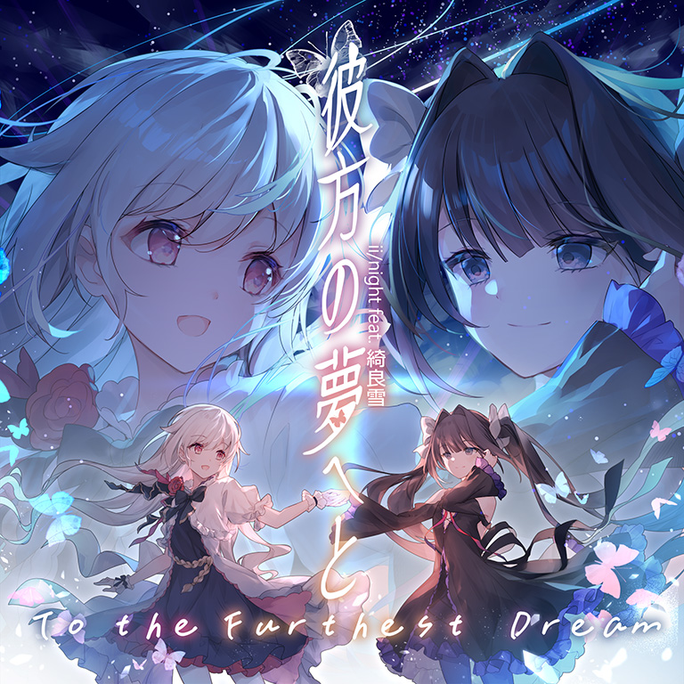
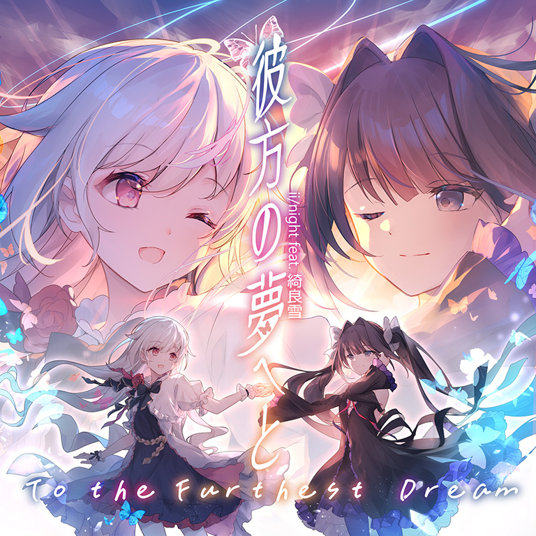

# To the Furthest Dream

> *后日谈*

- **Past 曲绘：**

- **Present 曲绘：**

- **Future 曲绘：**

- **曲师**：ii/night feat. 綺良雪
- **曲包**：Memory Archive
- **BPM**：183

### 谱面信息

| 难度 | Past | Present | Future |
| ------ | ------ | ------ | ------ |
| 等级 | 4 | 8 | 9+ |
| Note 数量 | 836 | 994 | 1102 |
| 谱面设计 |  |  |  |

- **背景**：epilogue
- **更新时间**：移动版v4.7.2(2023/09/14)(2023/10/27开放购买)

---

## 解禁方法

本曲各难度无需额外解禁

---

## 曲目定数

| 难度 | 定数 |
| ------ | ------ |
| Past | 4.5 |
| Present | 8.5 |
| Future | 9.8 |

• 本曲PRS难度谱面初出时的定数为7.5，在v5.4.0更新后改为8.5。

---

## 游戏相关

- 本曲为lowiro参加2023年的日本东京游戏展时放出的曲目，已于2023/10/27开放购买。
  - 游戏展活动当天，玩家可以打开此页面，并展示其上显示的的账号二维码(已失效)给Arcaea展台的工作人员来提前获取这首曲目。
- 本曲三难度使用了三个不同的封面，三者之间的差异主要为背景以及光和对立的微表情。
  - 本曲Past难度的曲绘曾经在v5.0.0时有过变更，旧版本的曲绘和当前版本的曲绘主要差异为背景的不同。
    - 该版本对游戏内的大量贴图、曲绘的质量和分辨率进行了调整，猜测Past难度曲绘背景的改动为该过程中出现的错漏所致。
- 本曲FTR难度谱面出现了大量与Last BYD和Solitary Dream相似的黑线表演，并出现了大量其他FTR难度谱面中几乎未出现过的超界配置，如中心抵达轨道边缘的贴地天键、大量的横向超界天键和所有FTR难度谱面中的第一个纵向超界音弧。
  - 和Last︱Moment相似，FTR难度谱面中全曲都有映射光和对立的黑线表演贯穿始终。
- 本曲是继Testify（属Final Verdict）和Silent Answer中的三首曲目后的第五首消色侧曲目，也是消色侧曲目第一次出现在上述曲包外的新曲包。
  - 该曲目的实装距离上次消色侧曲目的更新长达435天。
- 和Solitary Dream一样，本谱面未显示谱面设计者的名义。
- 本曲实际上是由田中文久和江口孝宏作词作曲、Irus进行吉他演奏，并由綺良雪演唱的。

---

## 歌词

### 原文

長い時、歪な嘆きの中
この夢は　追憶の過去を照らすわ
（私と）あなたの（存在を）
不確かな鏡越し　赤に染めないで

この手を離さぬように　私は生きる
悲しく佇む未来を　照らすヒカリ
祈りが　二度と笑顔を引き裂かないように
真実は　誰かの為に願うと知る事

いつか交わした言葉を　胸に抱いてく
（大事な想い）
自分を失わないで　全てを信じて

いつか交わした言葉を　胸に抱いて
世界を愛せる思いを　繋いでいく
一人で　あの日の傷跡に触れる事無く
巡り合う　導かれる奇跡へと

この手を離さぬように　私は生きる
悲しく佇む未来を　照らすヒカリ
全てを引き換えに　抱き締めた宝物
真実は　誰かの為に願うと知る事

### 参考翻译

于曲折的漫长时光中叹息
梦想唤醒了尘封已久的记忆
和我与你的存在
请勿透过那未知的镜片 再度染上那片赤红

我想与你同行 不愿放开你的手
在悲伤孤独的未来中 照耀着一道光
祈祷着 不要再让这抹笑容消逝
而现在 我已知道该为了谁而祈祷

总有一天我会将交织的言语 抱在怀里
（那重要的感情）
不要迷失自我 相信眼前的一切

总有一天我会将交织的言语 抱在怀里
爱着世界的这想法 连接着
而我一人 不会再接触那时的伤痕
邂逅了 那道被引导至此的奇迹

我想与你同行 不愿放开你的手
在悲伤孤独的未来中 照耀着一道光
相互付出了一切 紧紧拥抱着如宝物一般的彼此
而现在 我已知道该为了谁而祈祷

---

## 攻略

**Future 9+**

- 本谱以大量基础的单双押和折角蛇侧的出张单点为主要配置，整体主要考察玩家的定位能力，对底力的要求则显著较低，但部分配置对能力不足的玩家有一定的手癖可能性（如地键123轨位移八分单点、双押海夹单点等），整体难度位于9+下位
  - 此外本谱有大量超界天键出现，多集中于两段副歌段，其中多数有菱形黑线包围，注意横向出界定位
- 462-526combo的蛇侧单点略有视野遮挡，须注意划到蛇每一处顶点和单键定位
- 934-982combo的两组双押海中，每一组的双押海中都有一处是单点（均为双押*2+单点+双押*2），同时须注意侧边双押的手序
- 结尾的1022-1062combo天地手序变化较频繁，建议慢放练习，分清双押和单点是攻克本段的关键（其中部分为蛇和单键组成的双押）

**Present 8**

- 本谱以大量形态较为丰富的蛇为主要配置，部分配置的位移略大（如525-650combo），整体难度位于8级中位，适合新人练习较进阶的玩蛇
- 468-523combo的部分蛇出张幅度略大，注意划到每条蛇的折角处，否则较易漏蛇

---

## 试听

章节=试听

---

## 相关视频

https://www.bilibili.com/video/BV1VQ4y1H72H
