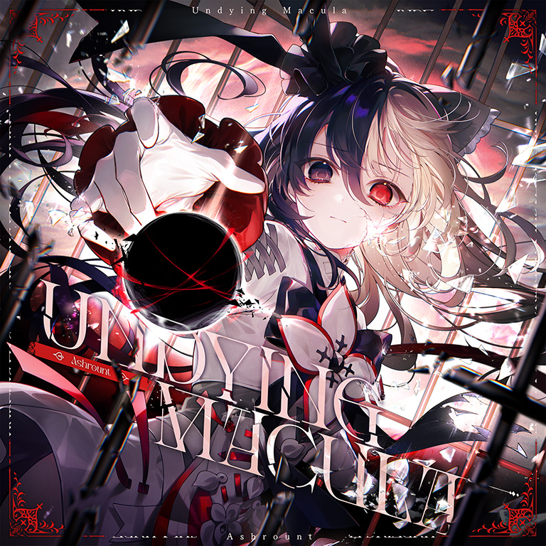

# Undying Macula

> *//谢谢你回应我的呼唤。//*

- **Undying Macula 曲绘：**

- **曲师**：Ashrount
- **时长**：02:43
- **曲包**：Liminal Eclipse
- **BPM**：63

### 谱面信息

| 难度 | Past | Present | Future | Eternal |
| ------ | ------ | ------ | ------ | ------ |
| 等级 | 5 | 8+ | 10 | 11 |
| Note 数量 | 883 | 904 | 1250 | 1461 |
| 谱面设计 | PHOTONSPHERE | ERGOSPHERE | EVENTHORIZON | M/V_BRIDGE |

- **背景**：macula_conflict_a
- **更新时间**：移动版v6.9.0(2025/10/02)

---

## 解禁方法

• **Past**：通关 ANDORXOR [PST]；阅读剧情【23-6】；体验Undying Macula
• **Present**：通关 ANDORXOR [PRS]；阅读剧情【23-6】；体验Undying Macula
• **Future**：通关 ANDORXOR [FTR]；阅读剧情【23-6】；体验Undying Macula
• **Eternal**：通关 ANDORXOR [ETR]；阅读剧情【23-6】；体验Undying Macula
- 第三个条件"体验Undying Macula"需完成前两个条件后才会从"???"变为真正内容。
在完成前两个条件后，第三个条件会从原本的“？？？”变为“找到她日记中的页面”，随后点击下方的“继续”才可推进解锁：

- 除开第一句表达计数的句子外，下述解禁提示文字在每一步完成后均会被划去，之后变为对应的剧情文字，在下方以斜体灰字表示。
  • 摩耶，壹。
    找到谁人的视线落在她身上的地方，她被带到另一个世界的地方。
    *如果有人哪天发现了这本日志：它存在的意义便是你。我会告诉你一切我所发现的事。*

- 前往世界模式中的Chapter 8，此时地图左上角会出现一个特殊的地图，点击该地图即可。
  - 如果当前处于因光（Fatalis）导致的过载状态，可以通过调整本地时间来跳过过载状态进入Chapter 8。
  • 摩耶，捌。
    她回想不起自己过去的模样。找到并珍藏一首反映她过去的歌曲。
    *我已死去，这毋庸置疑。我知道我的感受，我明白这都是我的错。*

- 收藏任何一首曲绘中带有维塔或维塔（Wanderer）或维塔（Cadenza）的曲目。
  • 摩耶，肆拾贰。
    找到将她带到另一个世界的人。
    *现在我可以肯定：这个地方的时间流逝的速度本身，*
    *以及和Arcaea世界时间流逝的关系均似乎有些诡异。这听起来很像时间膨胀。*

- 在搭档选择界面，切换至洞烛（至高：第八探索者）。
  - 如此前玩家本身就正在使用该搭档，则需切换至其他搭档后再切回该搭档。
  - 若未拥有该搭档，可前往故事模式中的剧情人物界面选择洞烛（至高：第八探索者）
  • _________，壹零捌。最后的字句，最后的署名。*谢谢你回应我的呼唤。*

- 长按前半句话（在游戏中这句话的亮度会略高于其他的字），直到下方的署名彻底完成，点击出现的“前进”，会进入剧情【23-7】。
在阅读完剧情【23-7】后，会播放一段视频，可游玩难度由玩家此前其他曲目的各难度通关情况决定，可在左下角切换，默认为可游玩的最高难度。首次游玩无法跳过该视频，须等倒计时结束后自动进入该曲目的游玩。

- 该次游玩包含游玩效果，详见后文阐述。
- 该次游玩会保存成绩，且各难度谱面解锁状态向下兼容。
游玩结束后，点击继续，将自动进入剧情【23-8】，在阅读完后，会回到该次游玩结算页面，并展示摩耶的觉醒动画[^1]。

---

## 曲目定数

| 难度 | 定数 |
| ------ | ------ |
| Past | 5.5 |
| Present | 8.7 |
| Future | 10.1 |
| Eternal | 11.0 |

---

## 游玩效果

在完成上述解谜过程并阅读完剧情【23-7】后，将以普通收集条进入该曲目的第一次游玩，该次游玩带有以下游玩效果：

- 游玩开始前，会播放一段视频，初次游玩不可跳过，可在左下角切换可切换难度；倒计时结束后进入本曲的游玩。
- 初次游玩开始时，回忆收集条和暂停键将会隐藏，曲名、曲绘、曲师以及难度等级均不展示。
  - 仍可以通过切换程序来强行暂停。
- 约1:09开始，轨道两侧出现红色的流动粒子特效。
- 1:23开始，曲目中段画面中心会出现一个迅速扩大并最终覆盖并遮挡整个屏幕全部信息的黑色实心圆，并在此后2秒内恢复Sky Input和地面判定线，远处出现一个发光的白边黑色菱形。再5秒后轨道恢复，再12秒后背景的一块半圆形部分显出macula light a的一部分，先前的红色粒子效果再次出现，并且随着音乐加速，再13秒后随着音乐的水滴声，背景彻底展开，曲目和谱面信息也全部正常展示。
  - 在1:23之前，背景为macula conflict a。
- 回忆收集条为普通模式，且曲目成绩在本地和服务器保存。

当玩家购买了Final Verdict曲包、完成Axiom of the End的全部挑战并解锁Testify，同时拥有搭档摩耶的觉醒形态后，选择摩耶并锁定其技能游玩本曲，就可以重现上述游玩效果。

- 仅要求拥有摩耶的觉醒形态，游玩时不要求使用其觉醒形态。
- 游玩开始时，回忆收集条、暂停键、曲名、曲师、曲绘和谱面定级不再隐藏。
- 世界模式中无法触发此游玩效果。
- 使用光 & 对立（Reunion）可以切换该曲的背景和流线装饰，切换后的背景为macula light a，但音符和轨道颜色不发生改变。

---

## 游戏相关

- 本曲是Arcaea第4届公募比赛"Coalescence"的异彩曲目（Distinction）。
- 本曲的ETR难度谱面在北京时间2025/10/02 9:30（更新当日）被玩家D4rkFlameMaster取得全球首个理论值成绩。
- 本曲是目前游戏中第三个可以换侧的终末曲（Terminal Song）[^2]，且是第一个自身拥有两个相对的专属背景的曲目。
  - 同时，两个背景有着不同的轨道背景特效。
- 谱师的名义为黑洞相关的术语，由PST到ETR其名义分别为：光子球层（光子在巨大引力尺度下围绕中心天体运动形成的球层）、能层（因黑洞旋转导致时空拖曳效应而使物质无法静止的区域）、事件视界（逃逸速度大于光速的边界）、M/V_BRIDGE对应的是ERB（爱因斯坦-罗森桥，即虫洞，连接两个曲率不同的时空曲面的结构），其中将ER替换成了MV（Maya&Vita）。
- 加长版收录至曲师个人专辑《QUOVADIS》，此专辑发行于本曲在游戏内实装的同月内。

---

## 攻略

---

## 试听

- https://www.bilibili.com/video/BV1jexjzsEpU
- · (YouTube) 2=【Arcaea】Ashrount - Undying Macula

---

## 相关视频

## 注释

[^1]: 前提是已经完成Arghena的解锁与演出并获得了洞烛（至高：第八探索者）。若在解锁此曲之后才完成Arghena的解锁与演出，则会先使搭档摩耶立绘改变，出现部分崩坏效果与"MISSING"字样，随即立即展示摩耶的觉醒动画，在此之后才会获得搭档洞烛（至高：第八探索者），同时显示"Domain Breached"字样。
[^2]: 前两个分别是Infinite Strife,与World Ender
