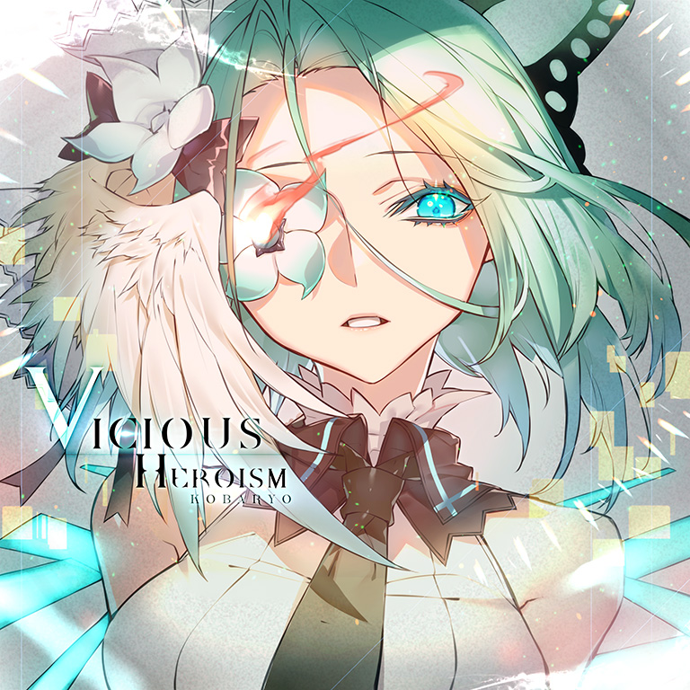
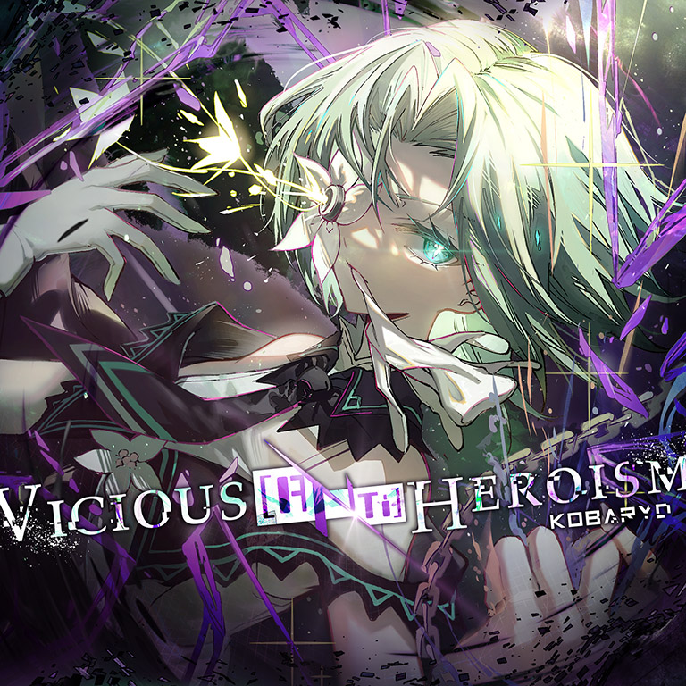

# Vicious Heroism / Vicious [ANTi] Heroism

> *恶毒英雄*

- **Vicious Heroism 曲绘：**

- **Vicious [ANTi] Heroism 曲绘：**

- **曲师**：Kobaryo
- **时长**：02:20
- **曲包**：Absolute Reason
- **BPM**：256（Beyond：271）

### 谱面信息

| 难度 | Past | Present | Future | Beyond (Vicious [ANTi] Heroism) |
| ------ | ------ | ------ | ------ | ------ |
| 等级 | 4 | 7 | 10 | 11 |
| Note 数量 | 430 | 756 | 1150 | 1772 |
| 谱面设计 | Nitro vanquish Toaster. | Nitro vanquish Toaster. | Nitro vanquish Toaster. | [FUTiLE] Defiance |

- **背景**：zettai（Beyond：viciousheroism3）
- **更新时间**：移动版v2.0(2019/03/21)，Beyond追加于v5.3(2024/01/25)

### 移动版
- Beyond前置条件：在世界模式陷落第一章，获得
• **Past**：无
• **Present**：50 残片
• **Future**：通关 Antithese [FTR]；通关 Corruption [FTR]；通关 Black Territory [FTR]；150 残片
• **Beyond**：无

### Nintendo Switch版
（该平台解禁数据未在 WikiText 中提供，需手动补充）

---

## 曲目定数

| 难度 | 定数 |
| ------ | ------ |
| Past | 4.0 |
| Present | 7.5 |
| Future | 10.0 |
| Beyond | 11.2 |

• 本曲PRS难度谱面初出时的定数为7.3，在v3.0.0更新后改为7.5(+0.2)。
• 本曲BYD难度谱面初出时的定数为11.1，在v6.0.0更新后改为11.2(+0.1)。

---

## 游戏相关

- 在v3.0.0大幅改标等级之前，本曲为PST 4，PRS 7，FTR 9。
- 本曲的加长版（Traitor Version）收录于SUPER RELEASE 21期间发行的专辑《SUPER DREAM ZONE》。
- 在v5.3.0本曲BYD难度更新之前的宣传图中，本曲的名字并未被正式提及，而是以“$̴̮͗!̷̰̏i̶͊͜^̶̨̔t̷̹̓N̶͋-&a”的密文形式出现。将密文中的字母提取出后倒序排列可得“aNti”，暗示了本曲BYD难度的曲名。
  - 但与其余两首曲目密文的解密结果直接暗示曲名不同，对本曲密文解出的字母并未和原曲名称产生直接联系，因而在更新前几乎没有玩家通过解密确定追加BYD难度的即为本曲。
- 陷落章中解锁本曲的绳子上从200%开始，分别限制全曲的FTR 10、FTR 10+、FTR 11（以及Vicious Heroism FTR）<small>(此处有争议）</small>，在领取了最后一个残片奖励后，改为限制所有的BYD曲目。
  - 值得一提的是，FTR难度等级为10+的TEmPTaTiON却被归入了FTR 10的区段内。
- 为了解锁本曲BYD难度谱面，除了曲包Absolute Reason本身以外，还需要购买单曲Libertas和Einherjar Joker，并且若没有通过世界模式解锁Purple Verse则还需要购入Extend Archive 1曲包，预计需要1400记忆源点。
  - 但通过五周年兑换券兑换曲包Absolute Reason，通过世界模式解锁Purple Verse，使用官方每年元旦赠送的记忆源点（每年100记忆源点）或新手任务第五章提供的单曲兑换券兑换Libertas和Einherjar Joker后，本曲BYD难度谱面也是可以免费获取的。
    - 这使得本曲成为了全游第一首理论上能够免费获得的BYD 11级曲目，也是全游理论获取成本最低的11级曲目（最低值为50记忆源点）。

---

## 攻略

此章节可能包含主观内容。

**Future 10**

- 本谱面综合配置较为简单，全谱未出现8分以上的采音，但较高的BPM使得多数常规配置失误率更高，在基本没有休息段的情况下对底力、耐力均有一定要求，尤以672-692combo处的天键海和尾杀部分底力要求更高，在现有的10.0中有一定难度
- 672-692combo处天键海的手序是双-右-左-右-双-左-右-左-双-右-左-双-右-左-双
  - 即双押-右起三连-双押-左起三连-右手起的2112112
- 827combo开始的尾杀部分八分硬抗的频率比前面部分更高，底力要求更高
  - 主要难点在于多数八分硬抗需要额外经过从天到地的位移，在不熟悉排键的情况下容易忽视这种位移关系从而错误发力，建议充分熟悉谱面和发力关系后再尝试上手谱面

**Beyond 11**

- 本谱综合配置较易理解，但在271的超高BPM下，对底力和爆发力提出了相较FTR更为极端的要求；与FTR类似，可在充分熟悉谱面发力关系后再尝试攻略，除此之外也可通过听原曲来找到此BPM下适合的发力方式
  - 部分蛇对于定位力同样有一定要求，尤以尾杀部分为重，实操时多加注意

---

## 试听

- · (YouTube) Kobaryo - Vicious &lsqb;ANTi&rsqb; Heroism <nowiki>|</nowiki> Arcaea

---

## 相关视频

- https://www.bilibili.com/video/BV1sJ4m1b7wd
- https://www.bilibili.com/video/BV1LHNweNEyF
- https://www.bilibili.com/video/av75050416
