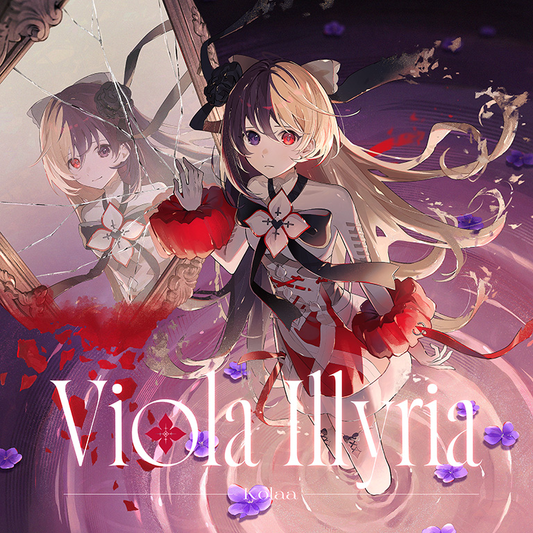

# Viola Illyria

> *第十二夜*

- **Viola Illyria 曲绘：**

- **曲师**：Kolaa
- **时长**：02:37
- **曲包**：Liminal Eclipse
- **BPM**：162

### 谱面信息

| 难度 | Past | Present | Future |
| ------ | ------ | ------ | ------ |
| 等级 | 2 | 6 | 9 |
| Note 数量 | 539 | 683 | 927 |
| 谱面设计 | sidewaves | sidewaves | sidewaves + Exschwasion |

- **背景**：eclipse_light
- **更新时间**：移动版v6.9.0(2025/10/02)

---

## 解禁方法

本曲各难度无需额外解禁

---

## 曲目定数

| 难度 | 定数 |
| ------ | ------ |
| Past | 2.5 |
| Present | 6.5 |
| Future | 9.5 |

---

## 游戏相关

- 本曲使用的vocal为GUMI(Synthesizer V)。
- 本曲为第一首中国大陆曲师以约曲的形式向Arcaea提供的原创乐曲。

---

## 歌词

### 原文

色彩の世界で揺蕩う堇
純白が空気を照らす
共鳴する音色と心たち
流れる風へと身を任せる

想いは血の底に沈み
空っぽな光は闇をかざして笑う

管をつたう赤い地平線
糸、虚しく空切る
どこまでも続くはれ
暗闇さえ鮮やかに映るはに
（進む衣擦れは哀愁の薫）

（残闇は失った時を知っている）
（終焉は永く、短いことも）

ささやきに 導かれ
柔らかな願いは永遠へ
はじめまして、いつかの世界

### 參考翻译

在色彩的世界摇曳的堇花
纯白点亮了周围的空气
与音色互相共鸣的心灵们
任由流淌的风将身体带向远方

思绪没入血液的深处
空虚的光线对着黑暗发出冷笑

赤红的地平线呈管道状蔓延
丝线徒然划破天际
那一望无际的晴空啊
就连黑暗也在这箱庭之中变得光彩夺目
（伴随着前进的脚步，衣衫摩动，飘散着哀愁的花香）

（残响承载着失去的时光）
（终焉亦刹那、亦永恒）

在低语呢喃的指引下
温柔的祈愿、化作永远
初次见面、这某时某刻的世界

---

## 试听

- https://www.bilibili.com/video/BV1vsHMz9EUL
