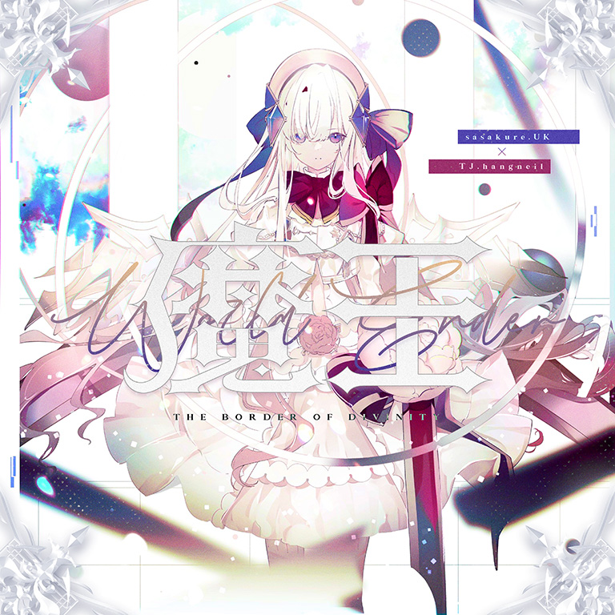

# World Ender / 魔王

> *魔王（谱面和字面含义）*

- **World Ender 曲绘：**

- **曲师**：sasakure.UK × TJ.hangneil
- **时长**：02:38
- **曲包**：Final Verdict
- **BPM**：190-280

### 谱面信息

| 难度 | Past | Present | Future | Beyond |
| ------ | ------ | ------ | ------ | ------ |
| 等级 | 4 | 7+ | 10 | 11 |
| Note 数量 | 616 | 850 | 1225 | 1661 |
| 谱面设计 | Imaginary Sky | Imaginary Sky | Imaginary Sky | Imaginary Sky |

- **背景**：finale_light
- **更新时间**：移动版v4.0.0(2022/07/07)

---

## 解禁方法

- 前置条件：解锁任意难度的Infinite Strife,。
- 进入Axiom of the End右上角的位置，共3项挑战需解锁：
  - I - 时初之间的歌曲：现实世界的每分钟开始时开始游玩任意一首曲目并通关
    - 在设备本地时间每分钟的00\~04秒（不含04秒）[^2]内开始歌曲，通关并结算。
  - II - 完美地，或是空洞地：曲目结算时皆为PURE判定、FAR判定或LOST判定
    - 游玩任意曲目，结算曲目时<u>判定全部为同一种</u>[^3]。
  - III - 创造奇迹，冲破世界：使用曲绘上的搭档通关一首对应的异象曲或终末曲
    - 以下方式任选其一即可完成（可封印搭档技能）：
      - 使用光（Fracture）通关Fracture Ray；
      - 使用光（Fracture）通关Arcahv[^4]；
      - 使用光 & 赛润妮·雪儿（Fracture & MIR-203）通关Fracture Ray[^1]；
      - 使用光 & 赛润妮·雪儿（Fracture & MIR-203）通关Arcahv[^1]；
      - 使用对立（Tempest）通关Tempestissimo；
      - 使用对立（Grievous Lady）通关Grievous Lady；
      - 使用对立 & 中二企鹅（Grievous Lady）通关曲目Grievous Lady；
      - 使用哀寂（至高：第六探索者）通关曲目Astral Quantization[^5]；
  - 可以通过在本地时间的00\~03秒任意选择以上一种异象曲组合并PM以一次性达成3个挑战。

---

## 曲目定数

| 难度 | 定数 |
| ------ | ------ |
| Past | 4.0 |
| Present | 7.8 |
| Future | 10.0 |
| Beyond | 11.1 |

• 本曲BYD难度谱面初出时的定数为11.2，在v6.0.0更新后改为11.1(-0.1)。
• 本曲FTR难度谱面初出时的定数为9.9，在v6.0.0更新后改为10.0(+0.1)。
• 本曲PRS难度谱面初出时的定数为7.5，在v5.4.0更新后改为7.8(+0.3)。

---

## 游戏相关

- 在v5.4.0大幅改标7级及8级的等级之前，本曲PRS难度的定级为7级。
- 本曲与其他通过Axiom of the End解锁的曲目一样，在完成其解锁任务后点击曲绘，即会播放本曲的PV，并在曲绘再次出现时可以选择即将挑战的曲目难度。
  - 6.0.0版本更新后，使用封印的光（Fatalis）游玩本曲，在正式开始游玩前会再次触发该游玩效果。
    - 该游玩效果在世界模式中不会触发。
- 本曲其实是sasakure.UK和其马甲名义TJ.hangneil“合作”而成。
  - 该曲师使用TJ.hangneil的马甲创作了音击的著名魔王曲Apollo，而在本曲中也出现了与Apollo相似的采样，甚至本曲BYD难度谱面中也出现了和Apollo在音击的Master难度谱面的一处配置形状类似的配置。
  - sasakure.UK在2022/07/09的推文称此次与TJ.hangneil的合作是通过五次元数据干涉完成的。
- 曲绘上注有英文：THE BORDER OF DIVINITY(神的界限)。

---

## 攻略

此章节可能包含主观内容。

**Beyond 11**

- 721\~775的配置均为双-地-天-地
- 873开始的纵连为等效于200bpm下的16分22连
- 1299、1306、1313的天键可以拆也可以硬扛
- 1324、1334两条蛇可以反接，同时天键夹地键可以分别在1328、1338处硬扛然后再继续拆成交互

**Future 10**

- 102/113/126/137的四处蛇尾判容易漏
- 139-173节奏较难建议目押
- 282-372的单指天转地连点需注意定位（尤其是最后两组）
- 372-443开始的一段反手蛇可以前半段都用右手接，后半段蛇都用左手接，每组最后一个反手键可以选择辅助指或者出张
- 628-706大弓蛇注意滑动的方向，位移要准确
- 854-918的交互每组最后三个可以硬抗
- 1011-1038可以一手接天一手接地
- 1148-1164的蛇有尾判

---

## 试听

- https://www.bilibili.com/video/BV1qa411n7UV
- · (YouTube) 2="魔王(World Ender)" sasakure.‌UK × TJ.hangneil [Arcaea]

---

## 相关视频

- https://www.bilibili.com/video/BV1aw411B7Km
- https://www.bilibili.com/video/BV1ik4y1V742
- https://www.bilibili.com/video/BV18U4y1D7Cp
- https://www.bilibili.com/video/BV1RS4y1n7g3
- https://www.bilibili.com/video/BV1krNueeEiW

---

## 注释

[^1]: 此方式为v6.4.1更新后新增。
[^2]: 如17:29:01、12:56:03等
[^3]: 但是实际上，由于目前全游戏没有只含单键的谱面，所以在解锁时只能是全Pure、全Lost或只有Pure和Lost；并且由于只需要进入结算画面即可，因而使用困难血条的搭档任意放置谱面，即可完成该任务
[^4]: 若此时已解锁Testify，则使用光（Fracture）游玩Arcahv会触发异象导致无法完成该挑战，故在此情况下需要封印光（Fracture）的技能。
[^5]: 此方式为v6.0.0更新后新增。
