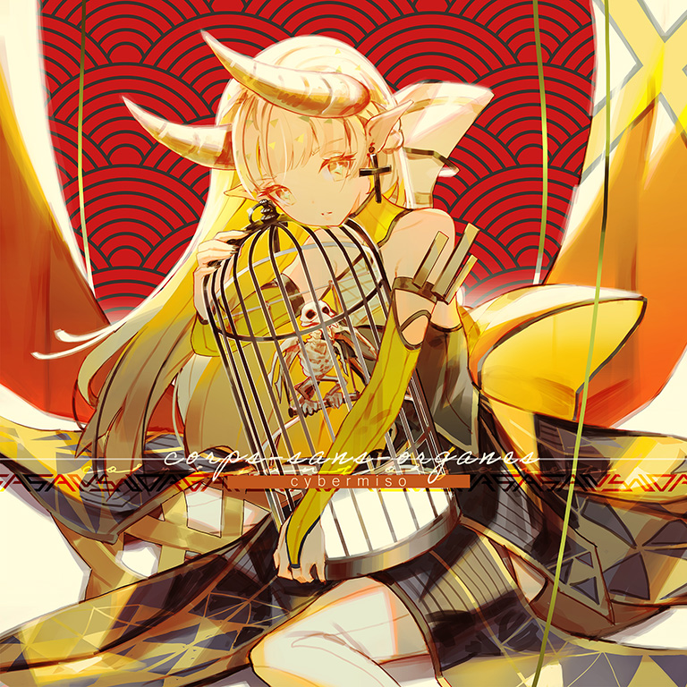

# corps-sans-organes

> *里黄*

- **corps-sans-organes 曲绘：**

- **曲师**：cybermiso
- **时长**：02:36
- **曲包**：Ambivalent Vision
- **BPM**：105

### 谱面信息

| 难度 | Past | Present | Future |
| ------ | ------ | ------ | ------ |
| 等级 | 4 | 7+ | 10 |
| Note 数量 | 438 | 615 | 1077 |
| 谱面设计 | 夜浪「月食」 | 夜浪「月食」 | 夜浪「月食」 |

- **背景**：mirai_awakened
- **更新时间**：移动版v2.6.0(2020/03/25)

---

## 解禁方法

### 移动版
- 前置条件：在世界模式第二章，地图2-5，第一个奖励获得
• **Past**：通关 Lethaeus PST；20 残片
• **Present**：通关 Lethaeus PRS；80 残片
• **Future**：以「A」或以上成绩通关 Lethaeus FTR；360 残片

### Nintendo Switch版
• **Past**：游玩 Lethaeus PST；35 残片
• **Present**：游玩 Lethaeus PRS；65 残片
• **Future**：以「AA」或以上成绩通关 Lethaeus FTR；100 残片

---

## 曲目定数

| 难度 | 定数 |
| ------ | ------ |
| Past | 4.5 |
| Present | 7.8 |
| Future | 10.6 |

• 本曲PST难度谱面初出时的定数为4.0，在v3.0.0更新后改为4.5(+0.5)。
• 本曲PRS难度谱面初出时的定数为7.0，在v3.0.0更新后改为7.5(+0.5)，又在v6.0.0更新后改为7.8(+0.3)。

---

## 游戏相关

- 在v3.0.0大幅改标等级之前，本曲为PST 4，PRS 7，FTR 9+。
- 在v5.4.0大幅改标7级及8级的等级之前，本曲PRS难度的定级为7级。
- 本曲的加长版收录于特典专辑Memories of Dreams中。
- 歌曲标题为法语，意为「没有器官的身体」（暗示忘却内心早已碎裂，独有空壳徘徊于Arcaea的世界）。
- 曲风以Glitch hop为基础，融合了Electronica与Intelligent dance music的成分。
- 本曲是Arcaea中的第4首非实时更新曲包后期追加曲目。
- 本曲后半段BPM转为210，结尾回归至105，但游戏内本曲BPM标注为105而不是105~210。
- 因联动收录至Rotaeno。

---

## 攻略

此章节可能包含主观内容。

**Future 10**

- 以**210BPM**计算，前半段多为12分交互，后半段转为16分，而结尾回归12分，整个谱中甚至有两处短24分交互，底力需求较高。
- 有与SAIKYO STRONGER相似的纵连紧跟双押的配置
- 部分音符有卡顿效果，容易爆FAR

---

## 试听

- · (QQ音乐) 试听

---

## 相关视频
