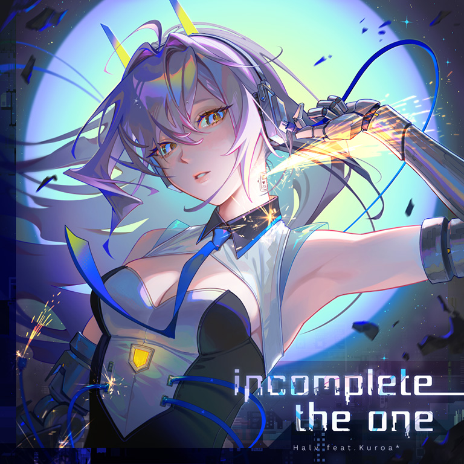

# incomplete the one

> *未结束的旅途……*

- **incomplete the one 曲绘：**

- **曲师**：Halv feat.Kuroa*
- **时长**：02:24
- **曲包**：Chapter Experientia
- **BPM**：208

### 谱面信息

| 难度 | Past | Present | Future | Eternal |
| ------ | ------ | ------ | ------ | ------ |
| 等级 | 3 | 7 | 8+ | 9+ |
| Note 数量 | 691 | 848 | 912 | 1008 |
| 谱面设计 | <>ntym1s | <>ntym1s | <>ntym1s | <>ntym1s |

- **背景**：anima_conflict
- **更新时间**：移动版v6.8.0(2025/08/21)

---

## 解禁方法

本曲各难度无需额外解禁

---

## 曲目定数

| 难度 | 定数 |
| ------ | ------ |
| Past | 3.5 |
| Present | 7.5 |
| Future | 8.8 |
| Eternal | 9.9 |

---

## 游戏相关

- 本曲是Arcaea第4届公募比赛"Coalescence"的优胜曲目。
- 本曲是Halv在Arcaea的第一首供曲。

---

## 歌词

### 原文

観測された 渇望するイド
欠落した儘に、抑えきれないモノ

「ただひとつ.......、」

作用する機構⇒決められた終わり。
完全になって、羽化する翅

叛逆する事象 選んだ時間ごと
心がバラバラになっても
始まり続けるため目覚めるよ
そうしてただ、ヒトとなる

反芻する思考 歪んだネガイゴト
世界がバラバラになっても
終わらないように救済しよう

そうして、ずっと
永久に、ただ知性（かみ）となれ

### 参考翻译

---

## 试听

- · (YouTube) 【Arcaea】Halv feat.Kuroa* - incomplete the one【Official】

---

## 相关视频
