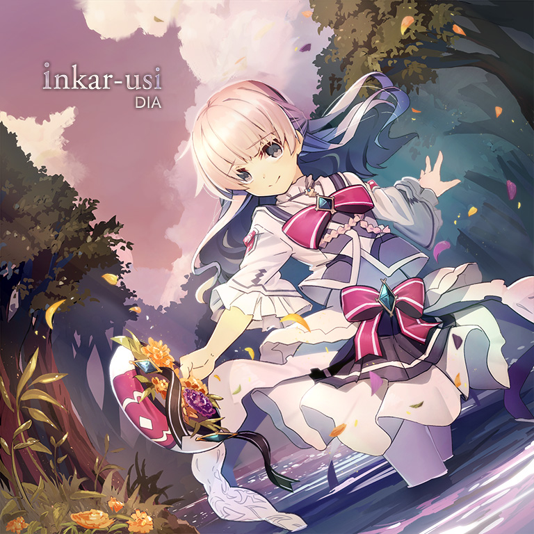
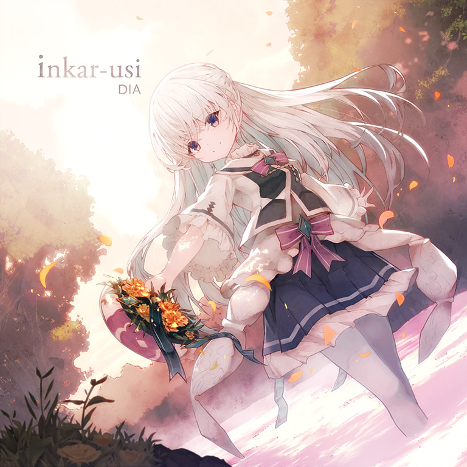

# inkar-usi

> *梦开始的地方！*

- **inkar-usi 曲绘：**

- **Beyond 曲绘：**

- **曲师**：DIA
- **时长**：02:23
- **曲包**：Arcaea
- **BPM**：102

### 谱面信息

| 难度 | Past | Present | Future | Beyond |
| ------ | ------ | ------ | ------ | ------ |
| 等级 | 2 | 4 | 7+ | 9 |
| Note 数量 | 276 | 326 | 463 | 857 |
| 谱面设计 | Kurorak | Kurorak | Kurorak | CERiNG |

- **背景**：base_light
- **更新时间**：移动版v1.6.6(2018/06/22)，Beyond追加于v5.3(2024/01/25)

---

## 解禁方法

### 移动版
- Beyond前置条件：在世界模式陷落第一章，获得
本曲各难度无需额外解禁

### Nintendo Switch版
本曲各难度无需额外解禁

---

## 曲目定数

| 难度 | 定数 |
| ------ | ------ |
| Past | 2.0 |
| Present | 4.0 |
| Future | 7.8 |
| Beyond | 9.4 |

• 本曲FTR难度谱面初出时的定数为7.8，在v3.0.0更新后改为7.5(-0.3)，又在v5.4.0更新后改为7.8(+0.3)。

---

## 游戏相关

- 在v5.4.0大幅改标7级及8级的等级之前，本曲FTR难度的定级为7级。
- 本曲的FTR难度谱面拥有全部FTR难度谱面中最低的物量(463)。
- 2018.6.22，DIA在推特上回复@Qutabire：”「インカルシ」というアイヌ語です。“(”inkar-usi为阿伊努语，阿伊努语是一种北海道方言。“)
  - inkar意为"眺望"，usi意为"位置"，合为"眺望之处"。
  - 事实上，在北海道有一个名为“远轻”的町，名称便是来源于这个词语。
- 因联动收录至CHUNITHM。

---

## 攻略

此章节可能包含主观内容。

**Beyond 9**

- 本谱以前半段的反手出张、地键位移二连和后半段的反手转圈蛇为主要配置，节奏上出现了较多48分三连，等价于204BPM下的24分，需要一定小爆发
- 前半段的反手需要较好的定位，可考虑通过辅助指逃课
- 219-231combo的交互为左起手
- 后半段的大量反手转圈蛇可通过将手指靠在一起以保持恒定距离同步，亦可通过设计反接手法通过

**Future 7+**

- 本谱面整体PM难度较低，但由于物量较低，爆一个far分数就会低10800分
- 有很多24分2连，注意节奏
- 后端的弧形蛇在中间有判定点，注意滑到位

---

## 试听

- · (QQ音乐) DIA - inkar-usi

---

## 相关视频

- https://www.bilibili.com/video/av75272279
- https://www.bilibili.com/video/av77597801
- https://www.bilibili.com/video/BV1SS4y1D7WV
