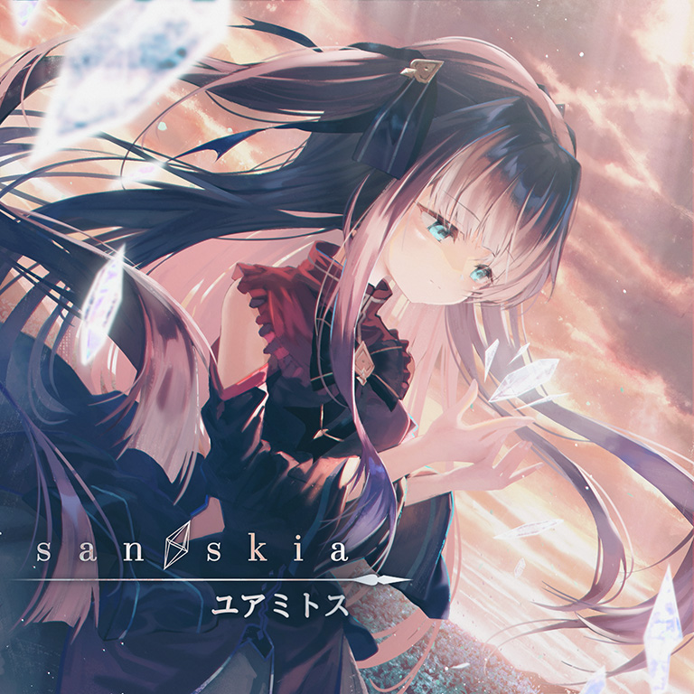

# san skia

> *Σαν σκιά*

- **san skia 曲绘：**

- **曲师**：ユアミトス
- **时长**：02:47
- **曲包**：Arcaea
- **BPM**：170

### 谱面信息

| 难度 | Past | Present | Future |
| ------ | ------ | ------ | ------ |
| 等级 | 3 | 6 | 8 |
| Note 数量 | 670 | 783 | 1046 |
| 谱面设计 | CERiNG | CERiNG | CERiNG |

- **背景**：alice_light
- **更新时间**：移动版v3.12.10(2022/05/25)

---

## 解禁方法

### 移动版
- 前置条件：在世界模式第六章，地图6-10，第二个奖励获得
• **Present**：通关 DDD PRS；60 残片
• **Future**：通关 DDD FTR；200 残片

### Nintendo Switch版
• **Future**：25 残片

---

## 曲目定数

| 难度 | 定数 |
| ------ | ------ |
| Past | 3.5 |
| Present | 6.0 |
| Future | 8.3 |

---

## 游戏相关

- 本曲曲名**san skia**是希腊语中把“像影子一样(表里一体)”的单词用罗马音读出来的词。
- 虽然曲绘上的人物为对立，但这首曲子却属于光芒侧。
- 因联动收录至NOISZ STARLIVHT。
  - NOISZ STARLIVHT侧谱面中的弹幕均使用了代表光和对立的颜色。

---

## 歌词

### 原文

名前のない記憶に
喉の奥が熱くって
心の悲鳴に
初めて気付く…

痛みがあるからきっと
優しくもなれる
束の間の凪を尊く思う

良く出来た
レプリカの星は
綺麗だけど
不意に侘しい

世界に満ちた
歓びの全てに
何度 手を叩いても
共鳴する生きた
心がなければ
ああ、同じ光を
望めはしない
私をまた拒んだ
触れたら枯れる花よ
美しいままで
出会えていたら

悪夢ばかりに
うなされて
僅かな予感も
汚してく

世界に落ちた
哀しみの全てを
憎むように見つめても
共鳴する生きた
心がなければ
空虚な苛立ち
同じ涙を
流せはしない
対極にいるようで
酷く似ている
終わらない2つの
螺旋を壊して
知りたかっただけ

世界に満ちた
感情の全てを
抱きしめて
なぞっても

共に生きてく
誰かがいなければ
ああ、光も影も
幻想と同じ
あなたも同じ

### 参考翻译

此章节所记录的歌词/翻译的来源不具有官方性质，仅供参考。
- 译者：现世的魔法少女

望见这无名的记忆
喉管深处涌上热意
才第一次发觉自己
心中的悲鸣…

既然会感到疼痛
一定也能因而温柔
将短暂的风平浪静
珍重地对待

那精雕细琢的
仿制星星
正欣赏着其美丽
却忽感悲凉

向这盈满世间的全般欢喜
纵使无数次感叹拍手喝彩

若没有与之共鸣的鲜活内心
啊啊 便不会期望相同的光明
再度将我拒绝了
一触便枯萎的花啊
若在你仍旧美丽时
便能够相遇

被无尽的噩梦
折磨魇住
些微浮现的预感
也逐渐肮脏

向这堕落世间的全般哀戚
纵使注视的目光仿佛憎恶

若没有与之共鸣的鲜活内心
便只是徒增煎熬
不会流下相同的泪水
处于这对立的两极
却又过分相似
永无终止的双螺旋
在此予之毁坏
我只是想明白罢了

对这漫溢世间的纷繁感情
纵使紧拥入怀中
在心底描摹

若身侧没有
共同生存见证的某人
啊啊 不论变幻光影
皆与幻想无异
你亦如是

---

## 攻略

此章节可能包含主观内容。

**Future 8**

- 开头段蛇及396-472combo段的蛇比较骗手，注意左蓝右红原则
- 341-358combo，370-396combo都是三连音节奏型
- 总体不难，比较容易PM

---

## 试听

- · (YouTube) 【Arcaea】ユアミトス『san skia』Lyric Video

---

## 相关视频
